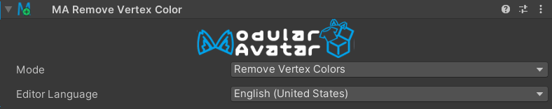
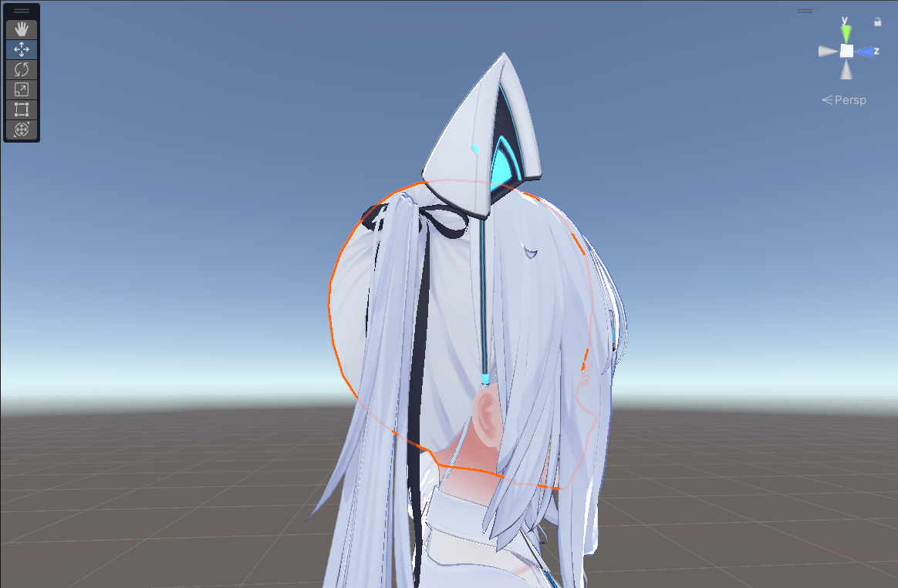

# Remove Vertex Color

The Remove Vertex Color component removes vertex colors from the object it is attached to and its children.

## When should I use it?

Sometimes, models come with vertex colors that aren't intended for display. When changing to a shader that
makes use of vertex colors, such as the VRChat mobile shaders, this can result in undesired discoloration. You can use
this component to remove these vertex colors nondestructively.

    

        

        
        

        *Without Remove Vertex Color, some unwanted vertex colors discolor this avatar's hair.*
    

    

        

        
        

        *After adding Remove Vertex Color, the avatar's hair is the correct color.*
    

## Detailed usage

Simply attach the Remove Vertex Color component to an object in your avatar - often, you can just add it to the root
object. All objects below that object in the hierarchy will have their vertex colors removed.

If you want to exclude some objects, add a Remove Vertex Color component to the object you want to exclude and set
the mode to "Keep Vertex Colors". Any objects below this object will not have their vertex colors removed.