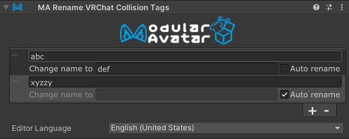

# Rename VRChat Collision Tags

The `MA Rename Collision Tags` component allows you to rename the collision tags used by the VRChat Contacts system
to avoid name collisions with other components or gimmicks.

## When should I use it?

You should use the `MA Rename Collision Tags` component when you have contacts that you don't want interfering with
other user's avatars, or when you want to avoid name collisions with other components or gimmicks on your own avatar.
You can also use it to configure multiple gimmicks to interact with each other by using the same tag names.

## How do I use it?

Place a `MA Rename Collision Tags` component on any GameObject in your avatar, and then add the tags you want to rename.
You can set them to be "auto rename" to have Modular Avatar automatically select a unique name for you, or you can
manually set the name to whatever you want. Any tags on contacts under the same GameObject will be renamed accordingly.

Note that placing the `MA Rename Collision Tags` component on a GameObject that is the parent of the `Root Transform`
of a contact located elsewhere in the hierarchy will not rename the tags of that contact.

You can also nest the `MA Rename Collision Tags` component under another `MA Rename Collision Tags` component. In this
case, the tags will be renamed according to the child component first, and then the parent component's settings will
be applied to the tags after that first round of renaming. This allows you to create a hierarchy of renaming rules,
and build complex gimmicks out of simpler components.