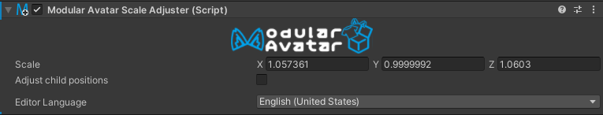
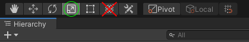

# Scale Adjuster

The Scale Adjuster component allows you to adjust the X/Y/Z scales of a specific bone without causing issues with
rotated child bones.

## When should I use it?

This component is primarily intended for use when fitting clothing not originally designed for your avatar. You can use
this to adjust the dimensions of specific bones, without breaking child bones.

## When shouldn't I use it?

When adjusting the overall scale of a bone (where X/Y/Z are being adjusted equally), it's usually better to use the
normal unity scale tools.

## Setting up Scale Adjuster

Simply add the Scale Adjuster component to the bone in question. Now, when you have the scaling tool selected, changes
will affect only this one bone.

You can check or uncheck the "Adjust child positions" checkbox to adjust the relative position of child bones when the
scale of their parent changes. This is useful when you want to adjust the scale of a bone, but don't want to move the
child bones. Note that this adjusts only the _position_ of child bones, and not their scale.

Scale Adjuster supports adjusting the scale of multiple bones by adding the Scale Component to all of the bones in
question, then selecting multiple bones before adjusting their scale. However, if these bones are rotated, the scale
adjustment won't be perfect, and may not give quite the results you expect.

:::warning

Scale Adjuster only controls the unity scale tool. The combined Move/Rotate/Scale tool will still affect all children.

:::