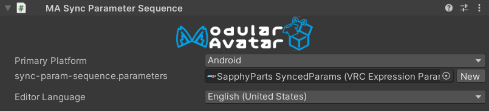

# Sync Parameter Sequence

On VRChat, it's necessary for parameters that are shared between different-platforms of an avatar (e.g. PC and Android)
to appear at the start of the expressions parameters list, and in the same order. This component adjusts the order of
your expressions parameters, and adds additional parameters where necessary, to ensure that your avatar syncs properly
between PC and Android.

## When should I use it?

You should use this component if you are uploading different versions of the same avatar to PC and Android, and both
versions make use of synced expressions parameters.

## When shouldn't I use it?

This component may have compatibility issues with certain VRCFury components, such as Parameter Compressor.

## How should I use it?

Simply attach the Sync Parameter Sequence component to any object on your avatar, then select which platform will be
your avatar's "primary platform". This is the platform that has _all_ of the parameters you want to sync defined.
If you're not using the VRCSDK's platform substitution feature, you'll also need to attach this component to the
platform-specific variants of your avatar.

Build on your primary platform first, then build on other platforms. When you build another avatar with the same
blueprint ID, Modular Avatar will automatically sync parameters to the other platforms.

:::warning

Your primary platform avatar must contain _all_ of the parameters that are synced on any variant of your avatar.
If any are missing, the build will fail.

:::