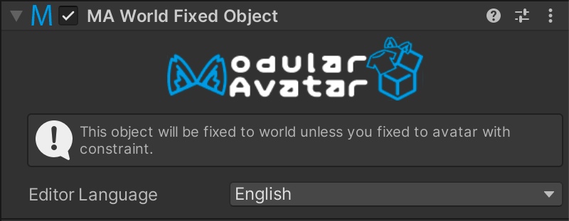

# World Fixed Object

This component can be used to make a GameObject stay in place relative to the world, even when the avatar moves.

## When should I use it?

When you want to have a prop or object stay in place when your avatar moves.

## Setting up World Fixed Object

Attach a `World Fixed Object` component to a GameObject. There are no configuration options to set.

The component will automatically generate a world-origin fixed GameObject at the avatar root and move your GameObject 
to its child. You can control the position of GameObjects within a World Fixed Object using e.g. Parent Constraints.

Only one constraint will be generated, even if multiple World Fixed Object components are used.
As such, the performance impact of this component is the same whether you use one or dozens.

Due to technical limitations on the Quest, this component can't be used when building for Quest standalone.