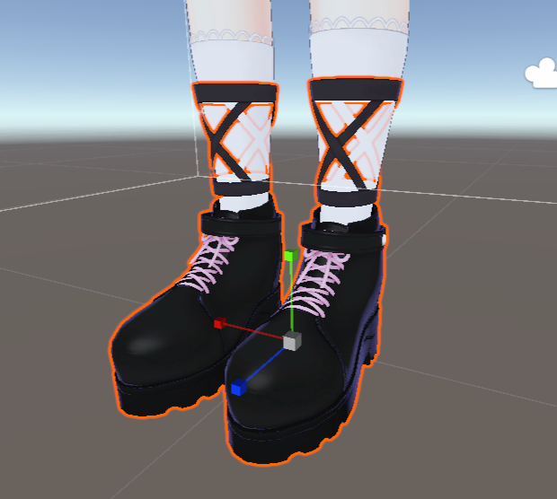
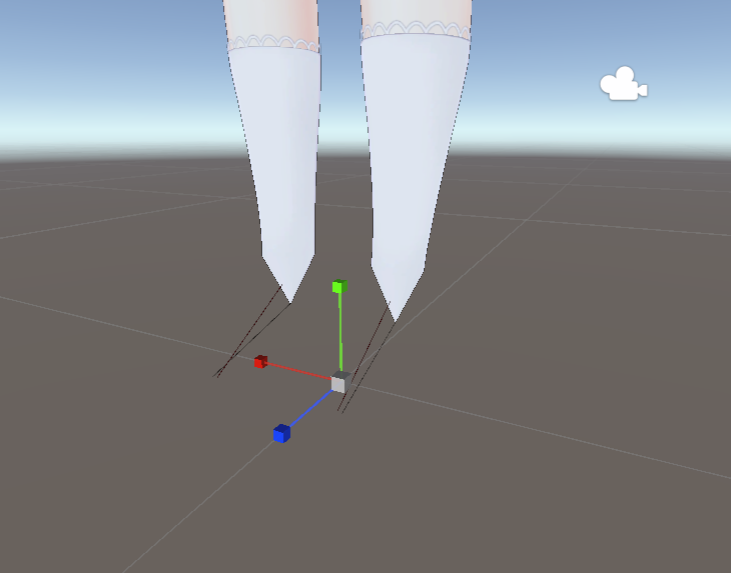
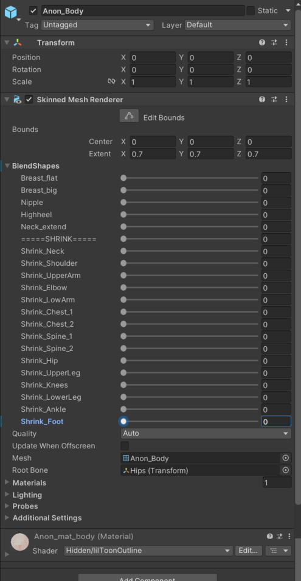
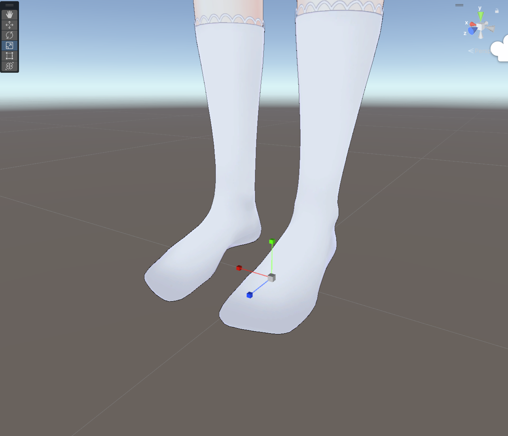
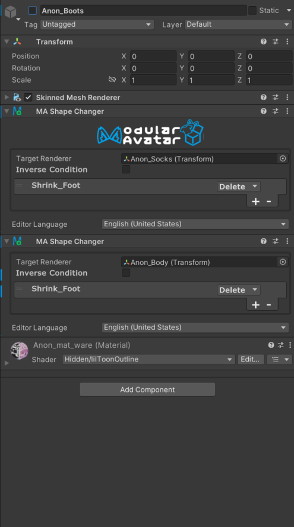
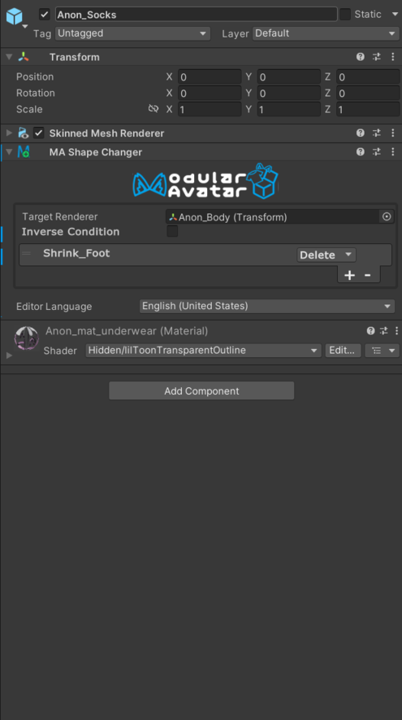
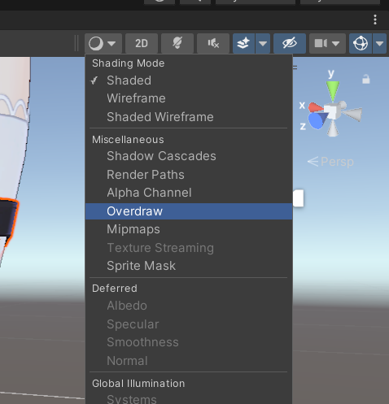
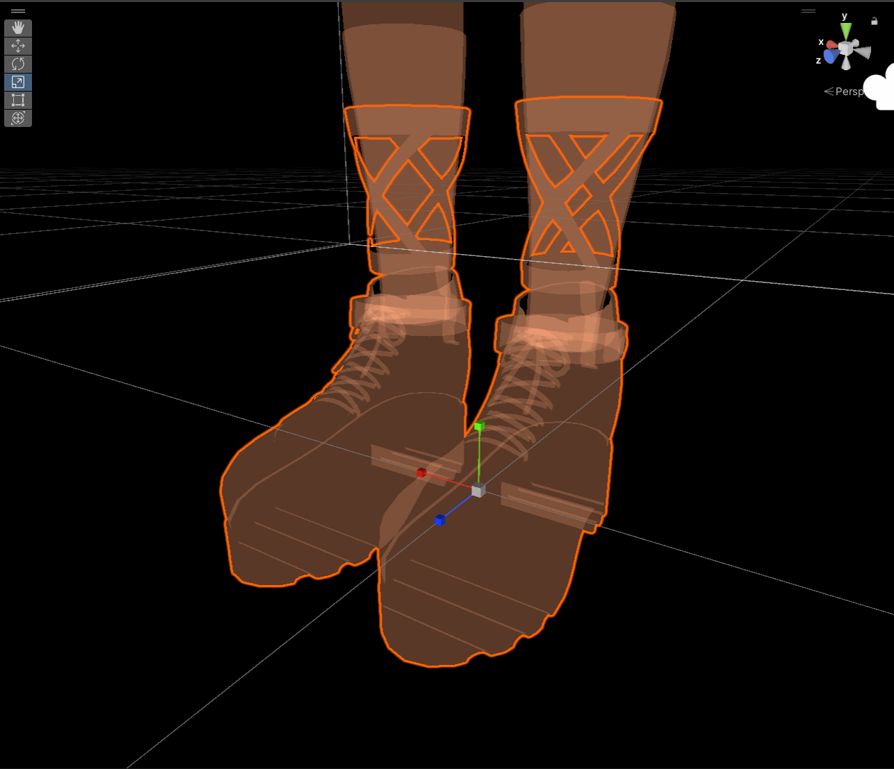
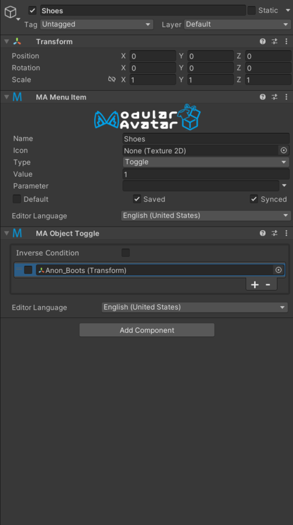
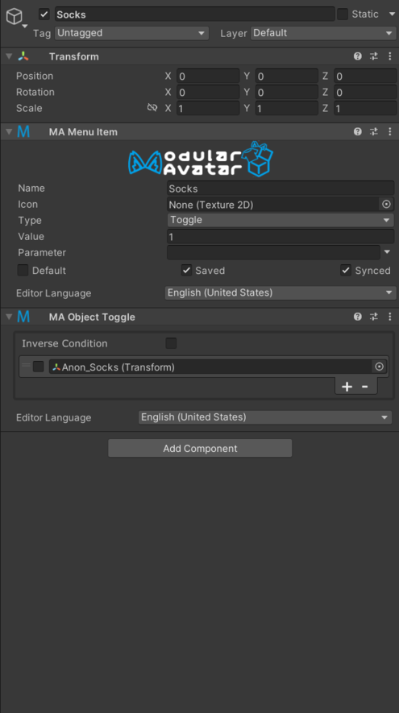

---
sidebar_position: 5
---

# Advanced toggles

Before we start, make sure you've read the [simple object toggle tutorial](/docs/tutorials/object_toggle/).
This tutorial will build on that tutorial, showing you how to also update blendshapes when toggling objects.

First, some background. Many avatars come with "shrink blendshapes", which are used to hide parts of the avatar, to
avoid them clipping through clothing. These blendshapes are often used in conjunction with toggles to hide and show
clothing items.

By using Modular Avatar's [`Shape Changer`](/docs/reference/reaction/shape-changer/) component, you can
easily update these
blendshapes
when toggling objects. Let's take a look at Anon's socks and shoes as an example.

<figure>

<figcaption>Shoes on</figcaption>
</figure>

<figure>

<figcaption>Shoes off</figcaption>
</figure>

As you can see, when the shoes are toggled off, you can see a bit of a stick here. This is because both the socks and
underlying foot are hidden by shrink shapekeys. Let's start by resetting them to zero.

<figure>

<figcaption>Anon_body blendshapes</figcaption>
</figure>

<figure>

<figcaption>Socks blendshapes</figcaption>
</figure>

<figure>

<figcaption>Blendshapes reset to zero</figcaption>
</figure>

Now, let's set up Shape Changer to toggle off the underlying layers. We'll add one to each of the shoes and socks
objects,
and shrink the layer(s) underneath them.

<figure>

<figcaption>Shoes Shape Changer</figcaption>
</figure>

<figure>

<figcaption>Socks Shape Changer</figcaption>
</figure>

Note that we use `Delete` here. This is because, if we don't have any animatable toggles, Modular Avatar will
automatically remove the underlying polygons instead of shrinking them, which can save on performance. If you have
anything that can animate the object in question, it'll instead set the shape to 100. You can use `Set` instead if you
want to keep the underlying polygons in all cases.

Shape Changer will preview its effects in the editor... but if we do it right it's hard to tell that it's doing anything
at all! To check, click on the debug overlay button, and select `Overdraw`, to get a see-through view of what's going
on.
If you shrink too much, however, it'll be immediately obvious in the scene view.

<figure style={{"width": "100%"}}>

<figcaption>Overdraw debug view</figcaption>
</figure>

<figure>

<figcaption>Overdraw view</figcaption>
</figure>

Now that we've set up our shape changers, we can go ahead and set up our toggles. Let's start by creating a submenu.
Create a new game object and add a `Menu Installer` and `Menu Item`. Then set the menu item type to `submenu`.

<figure>

<figcaption>Submenu setup</figcaption>
</figure>

Now, click `Add Toggle` to create a new toggle under this submenu. Give it a new name and add our shoes object to it.
Do the same for socks as well.

<figure>

<figcaption>Shoes toggle setup</figcaption>
</figure>

<figure>

<figcaption>Socks toggle setup</figcaption>
</figure>

:::warning

While we can preview the effect of these toggles by clicking the `default` checkbox on the menu items in
question, in the current version of Modular Avatar, the downstream effects of toggles on blendshapes can't be previewed
in the editor. Use Avatar 3.0 Emulator or Gesture Manager to test these out in play mode.

This limitation will be improved in future versions.

:::

And that's it! As you can see, Modular Avatar's Reactive Object system is designed to make it easy to set up shrink
shapekeys and other such common outfit settings.

:::tip

Outfit authors can preset these Shape Changers, to allow for easy installation of clothing, with automatically
configured blendshapes. The Reactive Object system responds to animations created by other NDMF-compatible systems, so
your users don't necessarily need to use Modular Avatar's toggle system to get the benefits of these blendshapes.

:::