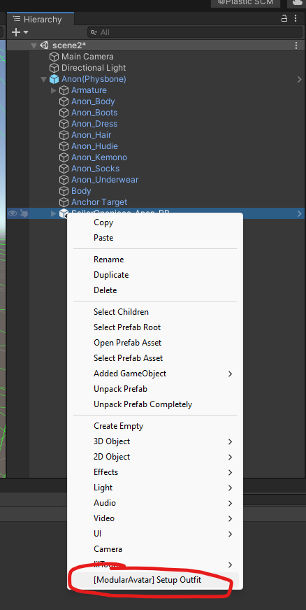
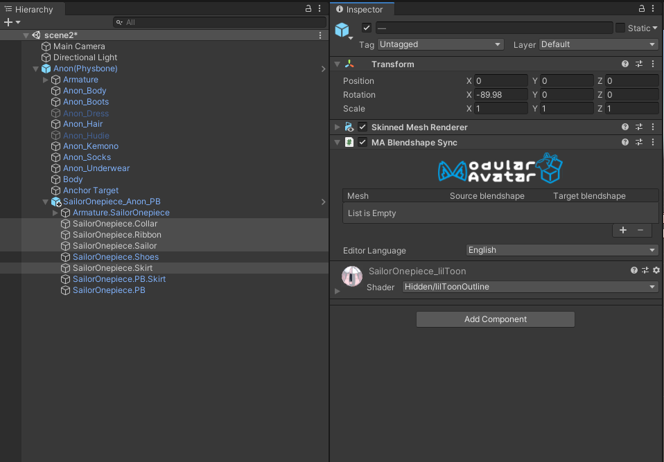
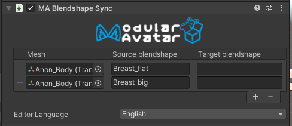

---
sidebar_position: 1
sidebar_label: Configuring a simple outfit
---

# Configuring a simple outfit

## Tutorial

With modular avatar, most simple outfits can be merged onto your avatar with one click. Let's give it a try.

This example will install Capettiya's [Sailor Onepiece](https://capettiya.booth.pm/items/3795694) onto Nagatoro Koyori's [Anon-chan](https://booth.pm/ja/items/3564947). We'll assume you've already installed VRCSDK and Modular Avatar itself.

We'll start by just dragging and dropping the outfit prefab onto the avatar.

Now, we right click the outfit, and choose the `[ModularAvatar] Setup Outfit` option listed there.

At this point you can set up your animators as normal. Just turn on and off the `SailorOnepiece_Anon_PB` object if you want to enable or disable the outfit as a whole.
For the purposes of this test we'll just turn off the original outfit objects manually.

When we go into play mode, we can see that the outfit is following the avatar's armature:

If you ever want to remove the outfit, just delete it from your avatar's hierarchy.

:::tip

With Modular Avatar, you don't need to unpack the original avatar or outfit prefab! This makes updating your avatar, in case a new version is released by the author, much easier.

:::

## What happened here?

When you click on the `Setup Outfit` option, Modular Avatar will automatically locate the armature object under the outfit, and attach a [Merge Armature](/docs/reference/merge-armature.md) component to it.

This component will automatically merge the bone heirarchy with the original avatar's bones, when you click play. When doing so, it minimizes the number of extra bones added, and ensures that all the physics bones and other active components stay in their original places, so you can manipulate them with animations without having to go through any hoops.

If we open up the avatar in play mode, we can see what it looks like after merging:

As you can see, the bones unique to the new outfit have been merged into the avatar's armature, while for bones that are shared between the outfit and the avatar, the outfit will reference the original avatar's bones instead.

## Linking blend shapes

You can also configure blendshapes on the outfit to sync automatically with the base avatar. To do this, add the MA Blendshape Sync component to the objects which have blendshapes that need to match the base avatar:

Now, click the + button. A new window will open to select a blendshape. Open up the collapsed sections to find the original avatar's
mesh and blendshapes of interest.

Double click the blendshapes of interest to add them to the Blendshape sync component. Optionally, you can rename them by filling out the "Target blendshape" field; if left blank,
modular avatar will use the name of the original blendshape.

Once you do this, modular avatar will sync the blendshape values from the original mesh to the new outfit. This will be done
both in the editor/inspector, and when uploaded (if you use animations to animate these blendshapes).