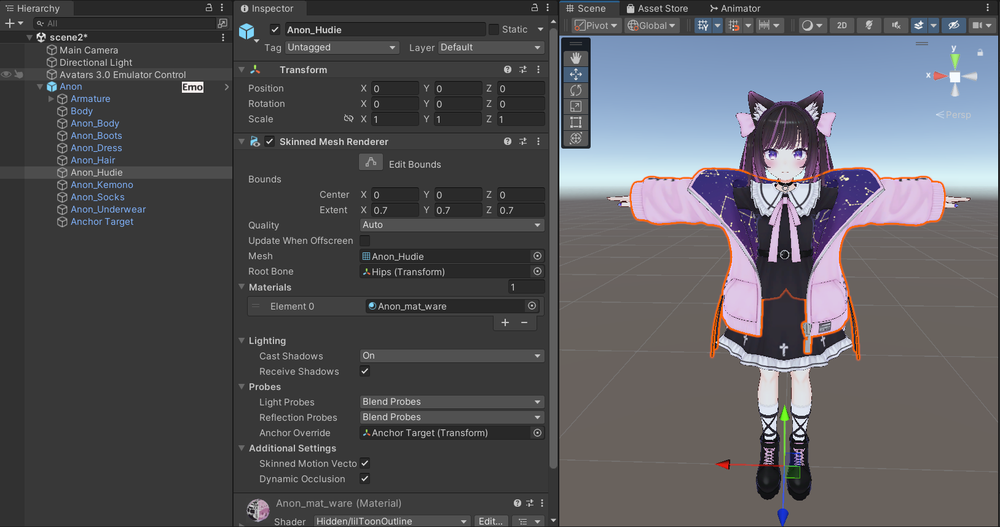
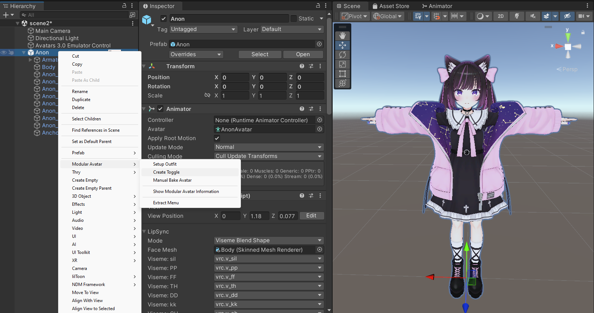
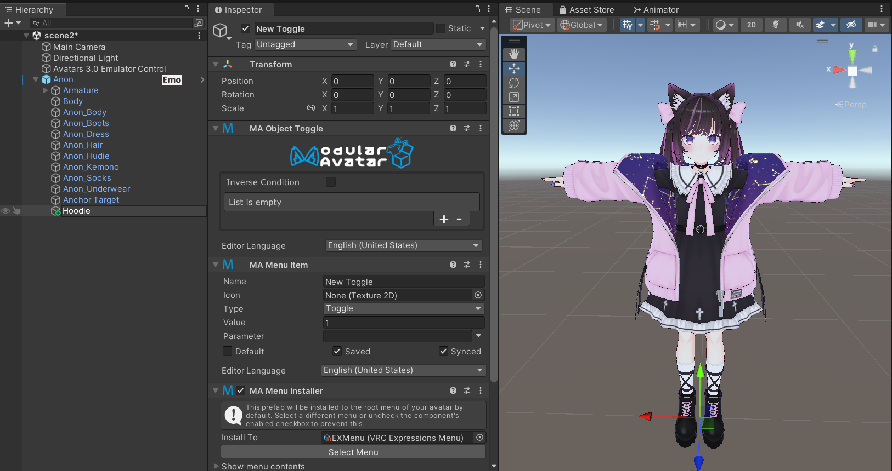
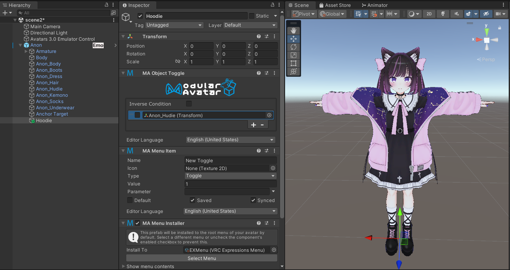
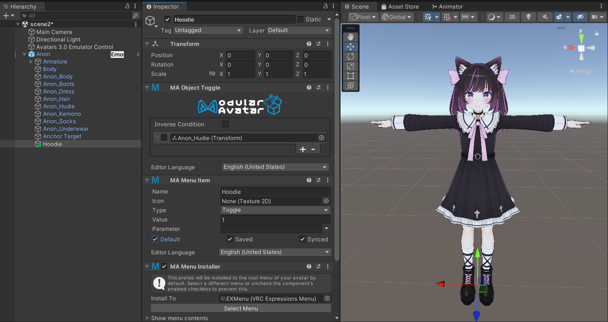

---
sidebar_position: 3
---

# Simple Object Toggle

In this tutorial, we'll see how to create a simple menu item to toggle an object using the Reactive Object system of
Modular Avatar.

We'll try toggling on and off Anon-chan's hoodie.

First, right click on your avatar, and select `Modular Avatar -> Create Toggle`.

When you do, a new GameObject will be created as a child of your avatar, with a `Menu Item`, `Menu Installer`, and an
`Object Toggle` component.

On the `Object Toggle`, click the `+` button to add a new entry. Drag the object you want to toggle onto the empty
field. Since we want this menu item to turn the hoodie off, we'll leave the checkbox empty.

At this point your toggle is fully configured. If you want to see it in action, click the `Default` box on the Menu
Item,
and you should see the hoodie disappear.

