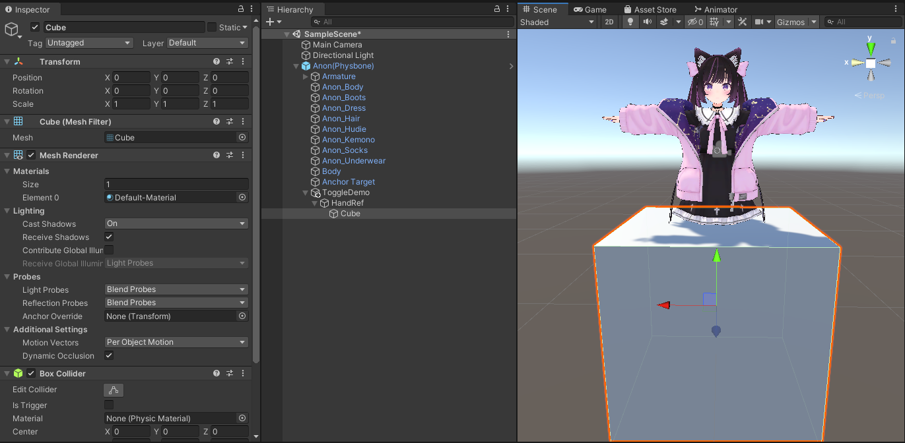
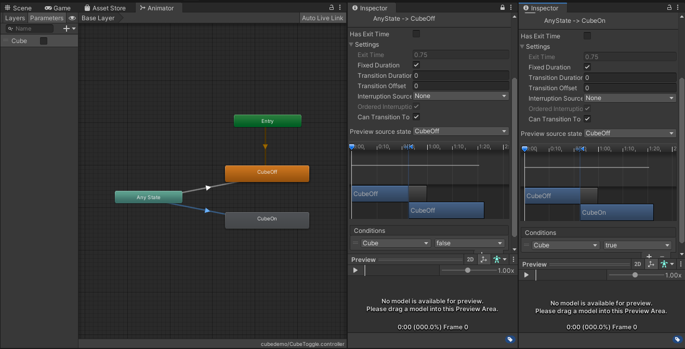

# Toggle an object (using manual animations)

In this tutorial, we'll create a simple prefab that makes a cube appear and disappear. We'll also
attach it to the avatar's hand, so it's easy to see.

## Step 1: Creating our objects

We'll start by creating the GameObjects we'll be showing. Start by dropping a test avatar in the scene,
and adding an empty GameObject to be the base of your prefab (we'll call this `ToggleDemo`). Inside this GameObject,
create a `HandRef` object
which we'll use to track the hand, and put the cube we want to display inside of that object.

### Attach the cube to your hand

Next, let's have the HandRef track the avatar's right hand. Select the `HandRef` object, and click `Add Component` in
the inspector.
Add a `MA Bone Proxy`.

Drag-and-drop the avatar's right hand bone into the "Target" field. Set "Attachment Mode" to "As child; at root".
The cube will immediately snap to the avatar's hand. Adjust its scale and position until it's not quite so in the way.
Don't forget to remove the Box Collider from the Cube as well!

## Step 2: Creating our animator controller

Next, we'll create an animator controller that will control the cube's visibility.
Create a new Animator Controller, and two animation clips (we'll call them `CubeOff` and `CubeOn`). Open the Animator
Controller, and drag the two clips in.
Then right click `Any State` and choose add transition to connect it to `CubeOff`. Do the same for `CubeOn`.

### Setting up transitions

Create a new bool parameter called `Cube`. Then, for each of your transitions, set Transition Duration to be 0, and Can
Transition to Self off.
Add our Cube parameter to the conditions, and for the CubeOff transition set it to false.

## Step 3: Merge Animator, and recording our animations

Go back to your top-level GameObject, and add a `MA Merge Animator` component.
Set the `Animator to merge` to your new animator controller. Check the `delete attached animator`
and `match avatar write defaults` boxes.
Then, _also_ add an Animator component, and point it to your new animator controller as well.

:::tip

Merge Animator doesn't need to be at the top level GameObject. Feel free to put it further
down the hierarchy if you prefer. Just make sure that `MA Parameters` (which we'll discuss further down)
is on either the same object, or a parent of all your `Merge Animator`s and `Menu Installers`!

Adding an Animator here is also optional; we're just using it so that Unity allows us to
record animations. By checking the `delete attached animator` box, Modular Avatar will delete the
`Animator` component at build time.

:::

## Step 4: Recording our animations

Go to the unity "Animation" tab. If you don't have it, press Ctrl-6 to open it.
You should see `CubeOff` and `CubeOn` (only) in the list of animations; if not, make sure that your `ToggleDemo` object
is selected.

With `CubeOff` selected, click the red record button, then turn the `Cube` GameObject off.

Then, with `CubeOn` selected, click the red record button, and turn the `Cube` GameObject off, then on again.

## Step 5: Setting up synced parameters

Almost there! Next, we'll set up our synced parameters, so they are automatically added.

Head back to our `ToggleDemo` object, and add a `MA Parameters` component. Click the `Show Prefab Developer Options`
checkbox.
You'll see that our `Cube` parameter is automatically added. Set Sync Mode to `Bool` and check the `Internal` box.

:::tip

If you set the internal checkbox, modular avatar will ensure that your `Cube` parameter doesn't interfere with anything
else on the avatar using the same parameter name.
If you leave it unchecked, the end-user will be able to rename the parameter if they want, but can also choose to have
multiple prefabs use the same parameter.

:::

## Setup 6: Setting up the menu

Finally, we'll set up the Av3 menu entry. Create an Expressions Menu asset:

Add one control to it; set the name to Cube, type to Toggle, and for the parameter field, enter `Cube` in the text box.
Note that because we haven't actually built the avatar yet, the parameter isn't in the dropdown yet. That's okay!

Now add a `MA Menu Installer` component to your `ToggleDemo` object. Open up the `Prefab Developer Options` section, and
put your expressions menu asset there.

At this point, we're done! If you build and upload the avatar, you should have a menu item which will summon a cube to
your right hand.

## Finishing up: Prefab conversion and component ordering

Let's get our cube ready to distribute. First, the components our end-users might want to mess with are primarily the
Menu Installer and (if you disabled the Internal checkbox) possibly MA parameters.
We might want to drag those up to the top of our inspector.

Once you're happy with things, drag ToggleDemo into your project pane to create a prefab. Now you can drop that onto any
other avatar, and have an instant cube!