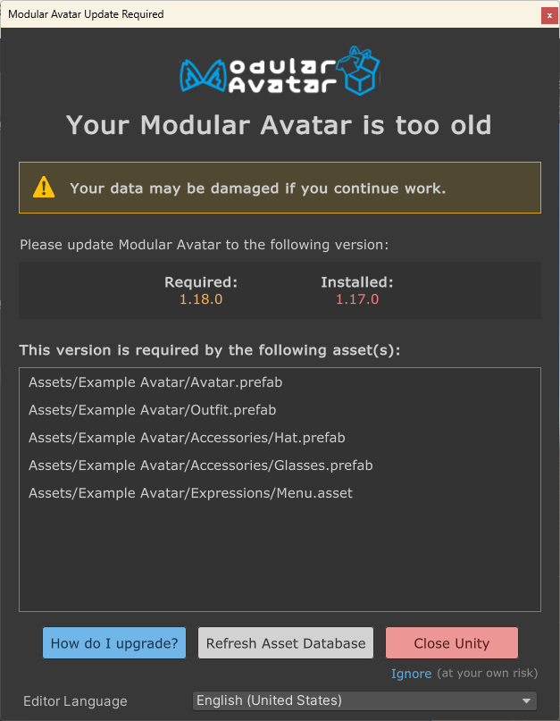

---
sidebar_position: 8
---

# How to update

If you're looking at this page, you may have seen a message that looks like this.

This indicates that you have an asset in your scene that was created with a newer version of Modular Avatar than you
currently have. The asset might not work properly in your version of Modular Avatar.

:::warning

If you edit and save an asset or scene while this warning is up, Unity might delete information related to settings
added in the newer version of Modular Avatar. It's best to stop and upgrade before you change anything.

:::

## ALCOM

The recommended way to upgrade is using ALCOM. Click the Manage button on the project list, then click on the version
next to Modular Avatar.

## VRChat Creator Companion

If you're using the VRChat Creator Companion, click "Manage Project" next to your project, then click the version
indicator next to Modular Avatar. 

## After updating

Once you've upgraded, click the "Refresh asset database" button - Unity will reload modular avatar, and if all is well
the warning will disappear.

## Suppressing the version warning

In some rare cases, you may want to update an asset to be usable on an older version of Modular Avatar.
The best way to target older versions is to create your asset on that older version, but if you need to suppress
the version warning, follow this procedure.

1. Create a project to use for the downgrade, install the version of Modular Avatar you want to target, and import your
asset.
  - Note: If you intend to target a version older than 1.18.0, first install 1.18.0. 
2. If a version mismatch warning appears, click "ignore"
3. Right click your prefab, or game object, and click "Modular Avatar -> Reset version information".
   Then, click "Set required version to current" (or, if you're targeting a version older than 1.18.0,
   click "clear required version data") 
4. Verify your prefab or game object works properly.
5. If you intend to target a version older than 1.18.0, now downgrade to that version, and verify correct behavior again.
6. Finally, import your updated asset into a project with the latest Modular Avatar, and verify correct behavior there as well.
