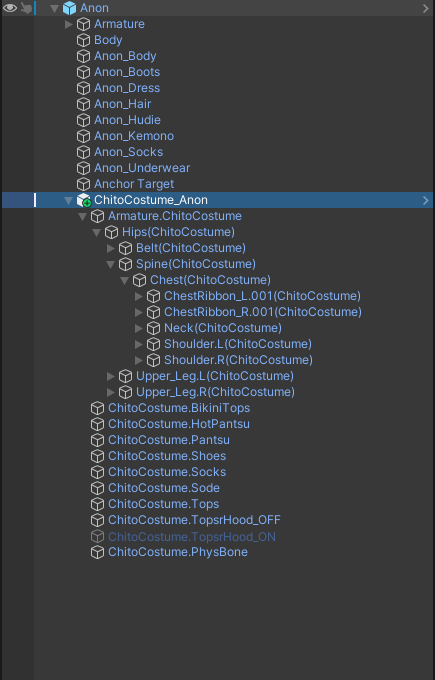

# 衣装制作者へのアドバイス

このページは、自作の衣装などをModular Avatarに対応させたいクリエイターに必要なノウハウを集めたものです。
基本的には、Modular Avatarは既存の衣装の設計に合わせて動作するように設計されていますが、たまには仕様から逸脱するものもあります。
このページにはModular Avatarが期待している設計と、その設計に合わせるための詳細な要件をまとめています。

## 忙しい人のための要約

「Modular Avatar対応」の衣装を作りたいならば、「Setup Outfit」が正常に動作することを確認してください。
「Modular Avatar設定済み」の衣装を作りたいならば、あらかじめ「Setup Outfit」を実行してください。さらに、以下の設定もご検討ください。

- Blendshape Sync（素体の体型変更に合わせて衣装のブレンドシェイプを自動変更）
- Shape Changer（衣装のON/OFFに応じて、素体の一部を縮小または非表示にするため）
- Menu Item と Object Toggle（ユーザーが衣装の一部をON/OFFできるようにするため）

## 「対応」 と 「設定済み」

始める前に、まずはModular Avatar向けの衣装には二つの対応レベルがあるということを理解しておきましょう。
最低限、ボーンの命名規則やPhysBonesコンポーネントの配置がModular Avatarが期待するものと互換性があることを確認することで、
「Modular Avatar対応」の衣装と言えます。ほとんどの衣装は自然と互換性があるため、詳細な要件を確認する必要はありませんが、
問題が発生している場合はこのドキュメントを参照してください。

「Modular Avatar対応」の衣装にはModular Avatarコンポーネントが含まれていないため、Modular Avatarを使用してインストールする必要はなく、
代わりに他の衣装インストールシステムを使用することもできます（もちろん手動で行うこともできます）。

さらに一歩進んで、Modular Avatarコンポーネントがすでに設定されたプレハブを提供することができます。これを「Modular
Avatar設定済み」と呼びます。
これにより、お客様にさまざまな便利機能やギミックを提供し、設定手順を簡素化し、導入に間違いが起きるリスクを減らすことができます。
たとえば、ブレンドシェイプを素体と自動的に同期させたり、衣装で隠れている素体の一部を非表示にしたりすることができます。
ただし、これにはお客様がModular Avatarをインストールしている必要があります。もちろん、複数のプレハブを準備し、Modular
Avatarコンポーネントが
含まれているものと含まれていないものの両方を提供することもできます。

「Modular Avatar対応」の衣装にはModular Avatarのロゴを使用することができないのでご注意ください。
詳細については[ロゴ使用ガイドライン](../logo-usage.md)を参照してください。

## 互換性の確認/デバッグのヒント

詳細を語る前に、「Modular Avatar対応」衣装を導入するための典型的なワークフローを見てみましょう。
ほとんどのユーザーは、衣装をアバターのGame Object内に配置し、右クリックして`Modular Avatar -> Setup Outfit`を選択します。
成功すると、必要なModular Avatarコンポーネントが追加され、アバターが準備完了になります。

正しく設定されているかどうかを確認するためには、いくつかのやり方があります。

### エディットモードでの姿勢同期

Setup Outfitをすると、衣装はエディットモードでも素体のボーンと姿勢を同期するように設定されます。いくつかの素体ボーンを回転させて、
衣装が正しく追従しているか確認してください。

### プレイモードでの確認

Modular Avatarはプレイモードでアバターをマージするので、そこでアップロード時の姿を確認できます。
Avatar 3.0 EmulatorやGesture Managerなどのツールを使用すれば、より正確なプレビューになります。

### Manual Bake

また、エディットモードでアバターを処理し、結果を表示することもできます。アバターを右クリックして`Modular Avatar -> Manual Bake Avatar`
を選択すると、
衣装が適用されたクローンが作成され、その結果を確認できます。

## Setup Outfit

### どういう仕組みなの？

Setup Outfitは、ほとんどの既存の衣装を認識し、基本的にな設定を行うように設計されています。その詳しい挙動を確認しましょう。

#### ボーンの認識

  
　*色で囲った部分をSetup Outfitが比較することで、衣装のボーンを特定しています。*

Setup
Outfitは、まず衣装内の特定のボーンを探し、それを処理の基準点として使用します。具体的には、`OutfitRoot -> [Armature] -> Hips`
のようなボーンを探します。
ここで`Hips`は素体のヒップボーンの名前を含む必要があります。ヒップボーン名の前後に任意のテキストがあっても構いませんが、全てのボーンで一貫している必要があります。
また、`Armature`のゲームオブジェクトの名前は何でも構いません。

衣装のボーンの命名がこれらのルールに従わない場合、Setup Outfitは衣装のボーン名と素体のボーン名を一致させるために、一般的なボーン名のリストと照合し、
一致するものがあれば衣装のボーン名を素体のボーン名に変更します。この方式は非対応衣装向けで、ボーン名一致に比べると安定性が低くなるため、
可能な限りボーン名を正確に一致させることをお勧めします。

#### T-pose/A-pose 変換

  

衣装と素体のボーンが同じポーズになっていない場合があります。例えば、素体がTポーズで制作されているが、衣装がAポーズで制作されている場合です。
Setup Outfitは、ボーンの位置を基準にして腕を回転させ、ポーズを合わせます。

#### Merge Armature コンポーネントの作成

  

Setup Outfitは、ArmatureオブジェクトにMerge Armatureコンポーネントを作成します。このコンポーネントには、ボーン名の前後にあるテキスト
（接頭辞・接尾辞）と、素体のアーマチュアへの参照が含まれます。このコンポーネントの影響で衣装のボーンがアバターのボーンにマージされます。
衣装にUpper Chestがあるが、素体にはない場合、Setup Outfitは複数のMerge Armatureコンポーネントを使用して対処します。

Merge Armatureは、ボーンの重複を回避するために、可能な限り衣装のボーンを素体のボーンに統合します。ただし、Transform以外のコンポーネントを含むボーンは統合されず、
代わりにアバターの対応するボーンの子に移動されます。

#### Mesh Settings コンポーネントの作成

  

Setup Outfitは、自動的にMesh Settingsコンポーネントを作成します。これにより、衣装内のすべてのメッシュに対してlight probe
anchorを素体に
合わせて設定したり、合理的なバウンズ設定も行っています。

### 処理前と処理後

Manual Bake処理前後の例を以下に示します。

  
  *処理前*

  
  *処理後*

見ての通り、ほとんどの衣装ボーンが統合されていますが、PhysBonesの設定により一部のボーンが残っています。また、素体に存在しないボーンはそのまま残されています。
各ボーン名の後に追加されたテキストは、複数の衣装を追加した場合の名前の衝突を回避するためのものです。

### Animation 修正

Merge Armatureは、アバター内のアニメーションに対していくつかの調整を行います。具体的には以下のような処理を行います。

- 移動したボーンに対応するアニメーションパスを調整します
- 衣装全体をON/OFFするアニメーションがある場合、そのアニメーションがバラバラとなった衣装全体のオブジェクトをON/OFFするように調整します。

これにより、ユーザーは通常、好きなアニメーション設定ツールを使用して衣装のルートオブジェクトをON/OFFにさせることができるし、
その時メッシュだけでなくPhysBonesコンポーネントもON/OFFに切り替わります。

### Bone Proxyとの違い

Bone Proxyに精通している場合、Merge Armatureとの違いが気になるかもしれません。Bone ProxyとMerge Armatureの違いは以下の通りです。

- Bone Proxyは、ボーンを統合することなく、1つのオブジェクトをアバターの別のオブジェクトの下に移動させます。ボーンの統合は行いません。
- Bone Proxyは、アバターのヒューマノイドボーンをターゲットにする場合、ボーンの名前に依存しない方法で保存されます。
  これにより、任意のアバターで動作する汎用的なギミックを作成できます。
- Bone Proxyは、オブジェクトの位置と回転の処理方法を選択できます。例えば、どこに手があってもアバターの手にオブジェクトを移動させることができます。
- Bone Proxyは、Merge Armatureと違ってON/OFFアニメーションの調整を行いません。Bone Proxyはアニメーションパス自体を修正しますが、
  Bone Proxyがついているオブジェクトの親をON/OFFしても、Bone Proxyオブジェクトとその子には影響しません。

Bone Proxyは、1つのボーンをターゲットにするアクセサリを作成する際に便利です。例えば、ヘアピンはHeadボーンにロックされたBone
Proxyを使用することができます。
Bone Proxyを使用することで、元々設定されていたアバター以外でも簡単に使用できるようになります。

### 意外と大丈夫な設計

対応してなさそうなのに、Setup OutfitとMerge Armatureが意外と対応しているケースがいろいろあります。以下にいくつか例を挙げます。

#### ボーン名の前後にテキストを追加

前述の通り、ボーン名の前後に接頭辞や接尾辞を追加することができます。これは、全ての統合されるボーンに対して同じ接頭辞や接尾辞を使用している限り、問題ありません。
同じ接頭辞や接尾辞を使用していないボーンは、基本アバターのボーンと統合されません。このとき、大文字と小文字は区別されるのでご注意ください。

#### ボーンの軸が異なる場合

  

    
    
*素体の肩ボーン*

  

  

    
    *衣装の肩ボーン*
  

3D モデリングソフトによって、軸の規則が異なることがあります。たとえば、X軸が肩から出ていることもあれば、Y軸やZ軸が出ていることもあります。
Merge Armatureはこれを自動的に対応します。基本アバターの回転を合わせる必要はなく、位置さえ合っていれば問題ありません。

#### Armature オブジェクトの命名規則

実は、Setup Outfitは`Armature`オブジェクト（ヒップボーンの親）の名前を気にしません。ヒップボーンのみを見ています。

#### A/T ポーズの変換

素体と衣装の腕の姿勢が異なっても大丈夫です。ただし、以下の点に注意してください。

- ボーンの長さが素体と完全に一致している場合のみ、A/Tポーズ変換が行われます。長さがわずかでも異なる場合、この変換はスキップされます。
- Setup Outfitは、ボーンの位置の差に基づいて回転方向を決定します。ボーンの位置がわずかにずれていると、意図しない回転が発生する可能性があります。

### 注意点

#### ヒューマノイドボーンでの PhysBones コンポーネント

一部の衣装には、HipsやChestなどのヒューマノイドボーンに PhysBones コンポーネントが付いているものがあります。これは推奨されません。
一部のケースでは機能するかもしれませんが、多くの衣装には誤ってベースアバターからコピーされた PhysBones が含まれているため、
Modular Avatarはこれを認識し削除しようとします。これにより予期せぬ動作が発生する可能性があります。

代わりに、素体に存在しない GameObject、あるいは Merge Armature コンポーネントのゲームオブジェクトの外に PhysBones コンポーネントを
配置したほうが安定した動作になります。

#### 素体と完全に一致した命名規則

ボーンだけでなく、Armatureオブジェクトも素体と完全に同じ名前の場合、厄介な Unity のバグが発生する可能性があります。
これを避けるために、Setup Outfitは Armature オブジェクトの名前に `.1` を追加してリネームします。
しかし、最初からこれを避けるのがベストです。Armatureオブジェクトの名前を変えるか、ボーン名に接頭辞や接尾辞を追加することで、
この問題を回避できます。

## Modular Avatar 設定済みの衣装

Modular Avatarをサポートするための最低限の要件について話しましたが、Modular Avatar設定済みの衣装を持つことは何を意味するかについて話しましょう。
通常、Setup Outfitがすでに実行されたプレハブを用意していることを意味します。お客様はこのプレハブをアバターに追加するだけで、
衣装が導入完了となります。もちろん、Setup Outfitを再度実行しても問題ありません。すでに設定されていることを認識し、処理をスキップします。

このように設定された衣装は、広告にModular Avatarロゴを使用することができる場合があります。
詳細な要件については[ロゴ使用ガイドライン](../logo-usage.md)を参照してください。

ただし、さらに一歩進んで、お客様にとってより便利な設定を行うことができます。以下にいくつかの例を示します。

### ブレンドシェイプ同期

一部のアバターには、体のさまざまな部分のサイズを変更するブレンドシェイプが含まれています。このような場合、衣装のブレンドシェイプを
自動的に操作して、基本アバターと一致させることができます。例えば、胸のサイズを変更するブレンドシェイプがある場合、
この機能を使用して衣装のブレンドシェイプを自動的に調整することができます。

### 縮小・非表示用のシェープキー

多くのアバターには、素体メッシュの一部を縮小したり非表示にしたりするためのシェープキーが含まれています。これにより、衣装が素体メッシュに
めり込むことを防ぐことができます。Modular Avatarには、この処理を自動化する機能があります。
[Shape Changer](../../reference/reaction/shape-changer.md)コンポーネントを設定することで、Modular
Avatarは対応するオブジェクトが有効になると、
シェープキーを自動的に縮小または非表示にします。また、アニメーションによって衣装の一部がオン/オフになる場合にも応答し、
Shape Changerオブジェクトが常に有効であれば、メッシュの一部を削除することさえできます。

### オブジェクトのスイッチ

多くの衣装には、ON/OFFできるパーツがあります。`Object Toggle`をあらかじめ設定することで、ユーザーに設定済みメニューを提供できます。
詳しくは[Object Toggleのチュートリアル](../../tutorials/object_toggle/index.md)にご参照ください。

また、一つのサブメニューにまとめることもできます。トグルオブジェクトの親に、このような設定のオブジェクトを用意しましょう。

