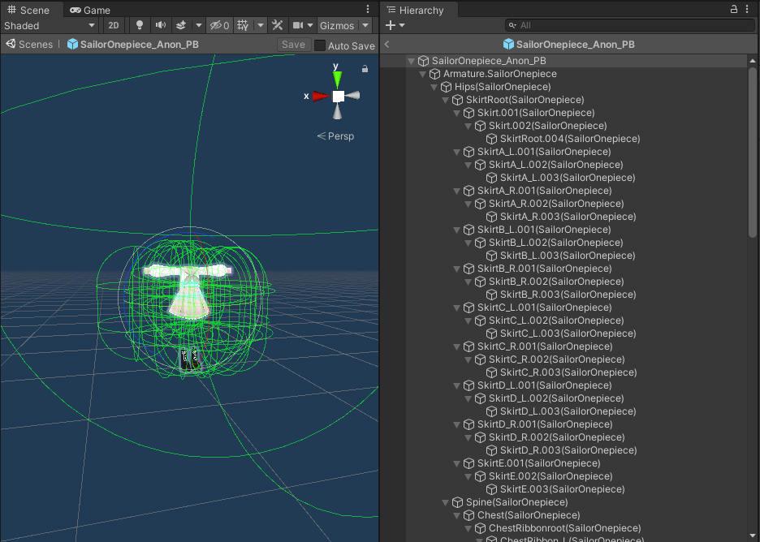
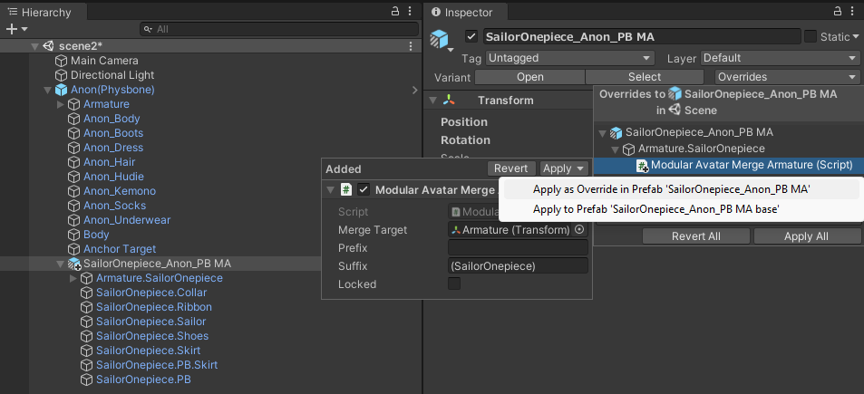

---
sidebar_position: 5
sidebar_label: アセット配布に関して
---
import ReactPlayer from 'react-player'

# Distributing Prefabs

Modular Avatarはアセット製作者の補助として、ドラッグアンドドロップだけでインストールできるアセットを製作できるように設計しています。
このページには、Modular Avatarを使ったアセットの配布に関するお勧めな手順などを纏めています。

## ユーザーをModular Avatarの正式配布ページに誘導してください

ライセンス上、アセットにModular Avatarを同封することは許可されています。しかし、古いバージョンをインストールしたり、
場合によってダウングレードさせて他のアセットの誤作動につながる場合があります。[Modular Avatarの公式配布ページ](https://github.com/bdunderscore/modular-avatar/releases)から
DLするように手引きすることを強くお勧めします。

今後、VCCを応用した簡易インストール方法を実装する予定です。VCC自体の改善・機能追加待ちですが、導入がかなり楽になると思います。

## ModularAvatarなしの環境にも対応するなら、ネスト状のプレハブを使いこなしましょう

プレハブにModular Avatarコンポーネントを追加すると、原則としてModular Avatarを導入せずに使うことができません。
一部のユーザーは何らかの理由でModular Avatarを拒むかもしれませんので、その環境にも対応するなら、衣装自体の設定とModular Avatarの設定を
ネスト状のプレハブで分けることができます。

使ったことがないなら、簡単に開設すると

1. まずは衣装のプレハブを作ります
2. プレハブモードでプレハブを開く（プロジェクトからダブルクリック）
   
3. プレハブのルートオブジェクトをプロジェクトウィンドウにドラッグアンドドロップ。確認画面が開いたら、「Create Base」を押してください。作られたファイルの名前を分かりやすく変更しましょう（例えば「衣装＿MAなし」）
   <ReactPlayer playing muted loop playsinline url='/img/creating-base.mp4' />

これが終わったら、もともとのプレハブにModular Avatarコンポーネントを設定し、その他の設定を新しく作られたベースプレハブに設定できます。Prefab overridesメニューを使えば、シーン上で行った調整を設定を簡単にどちらかのプレハブに適用させることもできます。
テストシーンにひとまず調整を行って、あとから各プレハブに割り振ることもできます。

## アニメーターを使ったアセットに内部パラメーターを使いましょう。

[内部パラメーター](/ja/docs/reference/parameters)を使うことで、他のアセットと干渉することを避けましょう。内部パラメーターは自動的にユニークな名前に変更されることで、名前かぶりが起きなくなります。