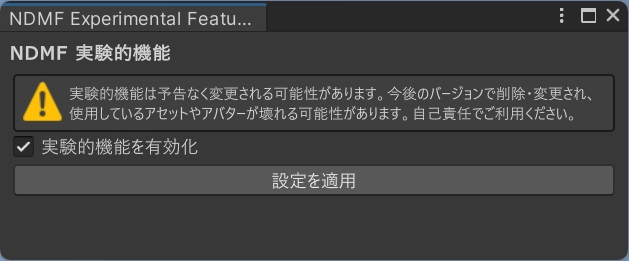

# 実験的な機能

Modular Avatar（およびNDMF）には、デフォルトで無効になっているいくつかの実験的な機能があります。開発途中の機能であり、将来的に動作が変更される可能性があります。
まだ完全にドキュメント化されていない場合があります。

:::warning

実験的な機能は、後方互換性のない方法で変更される可能性があります。
つまり、実験的な機能を使用すると、将来的にアバターやアセットを再設定・更新する必要が生じる可能性があります。

:::

## 実験的な機能の有効化

実験的な機能を有効にする前に、Modular AvatarとNDMFの最新の（ベータ）バージョンをインストールしてください。詳細については、[インストール手順](intro#betas)を参照してください。

実験的な機能を有効にするには、メニューバーの「Tools」→「NDM Framework」→「Experimental Features」を開いてください。実験的な機能を有効または無効にするウィンドウが開きます。

## 実験的な機能のリスト

- [Resonite 対応](./resonite-support.md)
- [汎用型アバター設定コンポーネント](./portable-avatar-components.md)