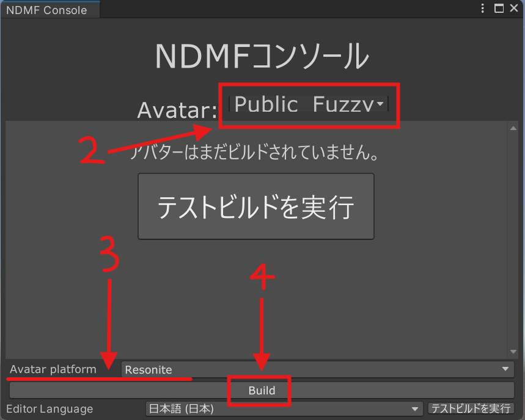
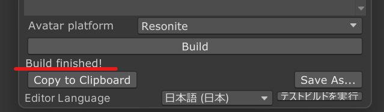

# Resonite対応

Modular Avatarでは、実験的な機能として、Resonite向けのアバターをビルドできます。

## ビルドに必要なツールの事前インストール

Resoniteアバターのビルドには、`Modular Avatar - Resonite support` / `Microsoft .NET Runtime 9.0` が必要です。
インストールされていない方は、以下の手順でインストールしてください。

### Modular Avatar - Resonite support

1. [インストール](../intro.md) を確認し、テスト版のリポジトリを追加します。
2. プロジェクトの "管理" より、 `Modular Avatar - Resonite support` の `+` をクリックし、「適用」をクリックしてください。

インストール後、[「実験的な機能のサポート」の有効化](../experimental-features)を実施してください。

### Microsoft .NET Runtime 9.0

1. Windowsの下部にある `検索` をクリック。 `terminal` と入力し、 `ターミナル アプリ` をクリックします。
2. 次の通り入力し、Enterを押してください: `winget install Microsoft.DotNet.Runtime.9`
3. 利用規約表示が出た場合は、 `Y` を入力し、Enterを押して進めてください。

## ビルド

以下の手順でResonite向けアバターをビルドします。

1. NDMFコンソール (Tools -> NDM Framework -> NDMF Console)を開く
2. ウィンドウの上部でアバターを選択
3. ウィンドウの下部「Avatar platform」で「Resonite」を選択
4. Buildをクリック

正常にビルドが完了すると、NDMF Console の下部に「Build finished!」というメッセージが表示されます。

:::tip

エラーが出る場合は `Console` タブをクリックし、一番下に出ている **赤色のビックリマーク** を確認してください。

:::

ビルドが完了したら、Resoniteにインストールします。以下の2通りの方法でインストールできます。

1. 「Copy to Clipboard」をクリックして、Resonite のダッシュメニューより 「クリップボードからインポート」 を押す
2. 「Save as...」をクリックして、アバターファイルを Resonite Package として保存後、必要に応じて Resonite に ドラッグ & ドロップ

Resoniteのビルドプロセスは、ビルド中にアバターの特定の機能（ビジュアル、目の位置、物理ボーン/ダイナミックボーンなど）を自動的にコピーします。
すでにVRChat向けにアバターを設定している場合は、追加の設定は必要ありません。
VRChat向けにアバターを設定していない場合や、VRCSDKがインストールされていない場合は、[Portable Avatar Components](./portable-avatar-components.md)のドキュメントを参照して、アバターの基本設定を行ってください。

## 現在対応している機能

| 機能 | 対応状況 | 制限事項 |
| ------- | --------- | ----------- |
| Avatar の視点位置 | ✅ | なし |
| Visemes（口パク） | 部分的 | ブレンドシェープ型のみ |
| 揺れもの設定 | 部分的 | 下記参照 |
| Reactive Components | ⌛ | 対応予定 |
| Unity Constraints | ⌛ | 対応予定 |
| 読み込み途中でのアバター表示への対策 | ✅ | None |

## 現在対応しているModular Avatarのコンポーネント

| コンポーネント | 対応状況 | 制限事項 |
| ------- | --------- | ----------- |
| Blendshape Sync | ⌛ | 対応予定 |
| Bone Proxy | ✅ | なし |
| Convert Constraints | ✖ | VRChat のみで対応 |
| Menu Group | ⌛ | 対応予定 |
| Menu Install Target | ⌛ | 対応予定 |
| Menu Installer | ⌛ | 対応予定 |
| Menu Item | ⌛ | 対応予定 |
| Merge Animator | ✖ | VRChat のみで対応 |
| Merge Armature | ✅ | なし |
| Merge Blend Tree | ✖ | VRChat のみで対応 |
| Mesh Settings | ⌛ | 対応予定 |
| MMD Layer Control | ✖ | VRChat のみで対応 |
| Move Independently | ✅ | なし |
| Parameters | ⌛ | 対応予定（DynVarとして実装する予定）|
| Physbone Blocker | ✅ | なし |
| Remove Vertex Color | ✅ | なし |
| Replace Object | ✅ | なし |
| Scale Adjuster | ✅ | なし |
| Sync Parameter Sequence | ✖ | VRChat のみで対応 |
| Visible Head Accessory | ⌛ | 対応予定 |
| VRChat Settings | ✖ | VRChat のみで対応 |
| World Fixed Object | ⌛ | 対応予定 |
| World Scale Object | ⌛ | 対応予定 |

## 揺れものについて

Modular Avatarは、[Portable Dynamic Bones](./portable-avatar-components#portable-dynamic-bones)またはVRChatのPhysBonesを使用して作成されたダイナミックボーンを検出し、コライダー設定を含めてResoniteのダイナミックボーンに変換しようとします。

Resoniteには独自のダイナミックボーンシステムがあるため、ほとんどの設定オプションは変換されません。ただし、除外（Physbone Blockersを含む）、コライダー、衝突範囲および掴めるかの設定は変換されます。

Dynamic Bonesは、ボーン名に基づいて、いくつかの名前付き「テンプレート」にグループ化されます。テンプレート名は、ポータブルダイナミックボーンコンポーネントにグループ名を指定することで上書きできます。
または、Resoniteで、`Avatar Settings` -> `Dynamic Bone Settings` スロットの下にあるオブジェクトをクローンし、新しいテンプレート名に設定し、ダイナミックボーンを定義したスロットの下にある`Template Name`スロットの名前を変更することで、新しいテンプレートを作成できます。

同じテンプレートの下にあるすべてのダイナミックボーンは、Inertia、InertiaForce、Damping、Elasticity、およびStiffnessの設定を共有します。これらの設定は、対象のダイナミックボーンのいずれかでも変更すればすべてが連動します。

## アバター設定ののコピー機能

Modular Avatarは、Resoniteアバターの異なるバージョン間でアバター設定をコピーするシステムを自動的に導入します。これにより、Resonite固有の設定（ダイナミックボーンの設定など）を設定し、Unityから再インポートした後に新しいバージョンのアバターにコピーできます。

具体的には、`Avatar Settings`スロットの下にあるすべてのスロットをコピーし、同じ名前のスロットがあれば上書きします。自分のスロットを`Avatar Settings`スロットに追加することもでき、これらもコピーされます。

設定をコピーするには、古いアバターをResoniteで着用し、新しいアバターをレーザーで持ちます。コンテキストメニューから`MA Settings Copier` -> `Copy To Avatar`を選択します。これにより、古いアバターの設定が新しいアバターにコピーされます。その後、新しいアバターを着用すると、設定が適用されます。

## 自動設定されるDynVar

Modular Avatarは、アバターシステムで使用できるいくつかのDynamic Variableを定義しています。

自動追加されるDynVarの仕様は、現在実験的なものも含まれるため、将来的に変更される可能性があります。

| 名前                                     | 型 | 詳細 |
|----------------------------------------| ---- | ----------- |
| `modular_avatar/AvatarRoot`            | `Slot` | アバターのルートスロット（`CenteredRoot`の親） |
| `modular_avatar/AvatarWorn`            | `bool` | アバターが現在着用されているかどうか（アバターがUserスロットの直下にある場合に検出） |
| `modular_avatar/AvatarSettingsRoot`    | `Slot` | `Avatar Settings`オブジェクト |
| `modular_avatar/AvatarPoseNode.[type]` | `Slot` | | `[type]`の`AvatarPoseNode`コンポーネントを含むスロット（例：`Head Proxy`） |
| `modular_avatar/MeshNotLoaded`         | `bool` | アバターのメッシュが読み込まれていないかどうか。なお、この変数は読み込み途中のメッシュがある場合「false」になり、ない場合は「未定義」になるので注意。この仕様は将来的に変更される可能性が高いのでご注意ください |
| `modular_avatar/HumanBone.[name]`      | `Slot` | ヒューマノイドボーンを名前で参照します。名義は今後変更される可能性があります。 |
| `modular_avatar/HumanBonePose.[name]`  | `float4x4` | 該当するボーンの初期ポーズです。_名前・内容の調整が入る可能性が高い機能です。|

なお、ほかのギミック用に、アバタールートに「Avatar」のDynamic Variable Spaceも生成されます。

<!-- TODO: Screenshots -->