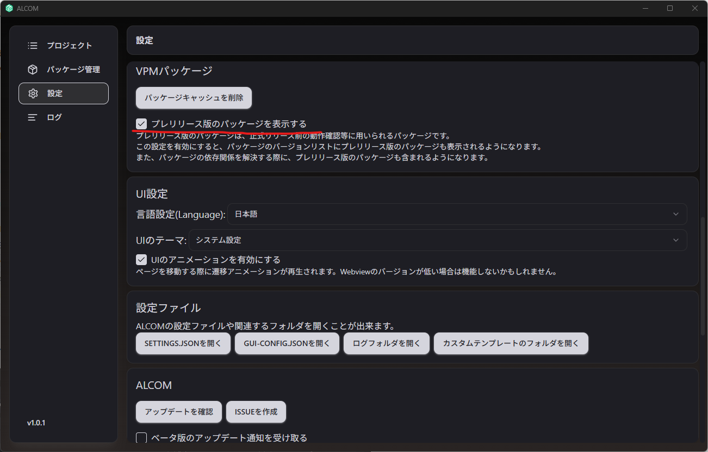

import Tabs from '@theme/Tabs';
import TabItem from '@theme/TabItem';

# Modular Avatar

Modular Avatar（モジュラーアバター）は、**非破壊的な**アバター製作用、そしてアバター部品の配布補助ツールの集まりです。
Modular Avatarを使えば、D&Dだけでアバターに新しい衣装やギミックを導入できます！

Modular Avatarの機能はそれぞれコンポーネントとして提供され、必要に応じて必要な機能だけ追加できます。自動的に衣装を統合したり、複数のアセットからアニメーターを構築したり、様々な面で製作を補助します。

## インストール

ALCOMでModular Avatarをインストールすることをお勧めします。VRChat Creator Companionを使用してインストールすることもできます。

<Tabs>
<TabItem value="ALCOM" label="ALCOM" default>

まずは[ALCOM](https://vrc-get.anatawa12.com/ja/alcom/)をインストールしてください。

インストール後、以下の手順でVPMリポジトリを追加してください。

* 「パッケージ管理」 > 「VPMリポジトリを追加」
* 「リポジトリ情報を入力」に次の値を入力し、「VPMリポジトリを追加」
  * 通常版: `https://vpm.nadena.dev/vpm.json`
  * テスト版: `https://vpm.nadena.dev/vpm-prerelease.json` (ベータ版使用の場合)
* 以下の情報が記載されることを確認し、「VPMリポジトリを追加」
  * リポジトリ名: `bd_`
  * URL: 入力したURL

終わったら、プロジェクトの"管理"を開き、Modular Avatarの+をクリックし、「適用」をクリックしてください。

最新版にアップデートするには、バージョン番号と緑色の矢印を囲った枠内をクリックし、「適用」をクリックしてください。

</TabItem>

<TabItem value="VCC" label="VRChat Creator Companion">
VRChat Creator Companionを使用したい場合、[こちらからVCCをインストール](https://vrchat.com/home/download)してください。

VCCをインストールしたら、こちらをクリックしてください：
* [Modular AvatarをVCCに追加](vcc://vpm/addRepo?url=https://vpm.nadena.dev/vpm.json)

その後、プロジェクトの"manage project"を開き、Modular Avatarの+をクリックしてください。

最新版にアップデートするには、"Latest Version"の緑色の矢印をクリックしてください。

</TabItem>
</Tabs>

## テスト版 {#betas}

:::warning

テスト版のインストールにはALCOMを使用してください。VCCの依存関係解決のバグのため、VCCではテスト版をインストールすることをお勧めしません。

:::

ALCOMでテスト版を使用するには、「設定」タブで、 `VPMパッケージ` の中にある `プレリリース版のパッケージを表示する`にチェックを入れてください。

テスト版のドキュメントは[こちら](https://modular-avatar.nadena.dev/dev)にあります.

テスト版は開発中のため、バグがあったり、互換性のない変更を加える可能性があります。
バグ報告やフィードバックは[GitHubのissueページ](https://github.com/bdunderscore/modular-avatar/issues)へお願いします。

## インストール後

インストール後は以下のチュートリアルを参照してください。

* [簡単な衣装設定](/docs/tutorials/clothing)
* [複雑な衣装設定](/docs/tutorials/adv_clothing)
* [アニメーターでトグル作成](/docs/tutorials/object_toggle/)
* [簡易メニュー作成](/docs/tutorials/menu/)
