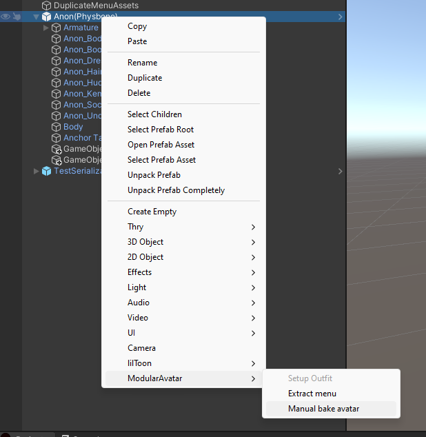

# 手動処理

VRChat向けにアバターを作る場合は、通常Modular Avatarに自動的にアバターを処理させてもよいはずです。
プレイモードに入るか、アバターをビルドすると、Modular Avatarが自動的に変換・適用します。
しかし、VRChat以外のプラットフォーム向けにアバターを作る場合や、アバターの問題をデバッグする場合など、手動でModular Avatarの処理を適用する
必要がある場合もあります。

アバターを右クリックし、`Modular Avatar -> Manual bake avatar`を選択することで、手動で処理できます。
Modular Avatarは、すべての変換を適用したアバターのコピーを作成します。

## 生成されたアセット

Modular Avatarは、アバターにアタッチしたコンポーネントに基づいて、いくつかのアセットを生成します。
アバターを手動で処理すると、この一時アセットがプロジェクトのメインAssetsフォルダーの下にある`ModularAvatarOutput`フォルダーに保存されます。
最初は、すべてのアセットが1つのファイルにパックされています。これは、Unityのバグを回避し、処理時間を短縮するために必要です。
ただし、プロジェクトビューでファイルを選択し、インスペクターペインで`Unpack`をクリックすると、このファイルを展開できます。

Unpackを押すと、生成されたアセットが別々のファイルに展開されます。

Unpackするかどうかにかかわらず、クローンされたベイク済みアバターを削除した後は`ModularAvatarOutput`フォルダーを削除しても大丈夫です。