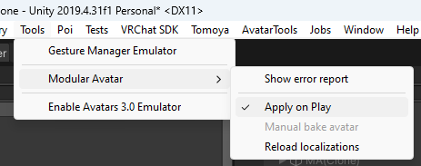

# 壊れたかな？

アバター処理中にエラーが発生すると、Modular Avatarがエラーレポートを表示します。

オブジェクト名をクリックすると、該当オブジェクトに飛べます。このレポートのエラーの多くは、アバターを編集すると自動的に更新されますが、一部のエラーは新しいビルドが必要です。

エラーレポートウィンドウを閉じた場合は、Tools -> Modular Avatar -> Show error report で表示できます。

## よくある問題

### 何も処理されてない！

Apply On Playにチェックが入っているか確認してください。

