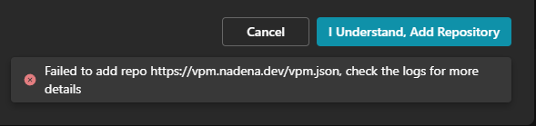
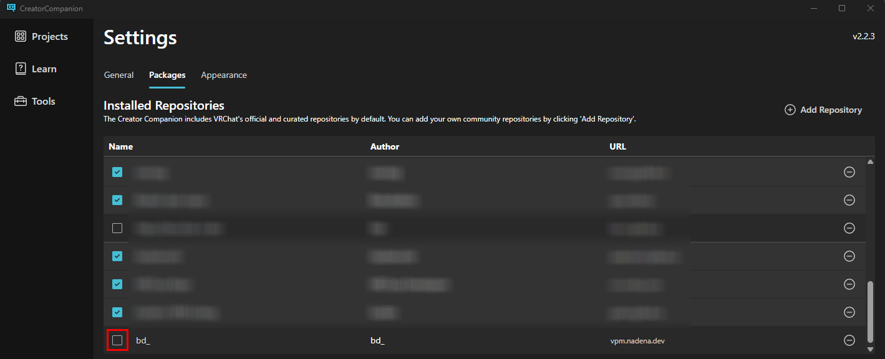

---
sidebar_position: 1
---

# インストール時の問題

Modular Avatarをインストールするときによくある問題と対処法です。

## "Failed to add Repo"

VCCのバグの影響で、Modular Avatarリポジトリを追加しようとすると、このようなエラーが発生することがあります。
リポジトリが既に追加されていることを意味することが多いです。パッケージリストにModular Avatarパッケージが表示されない場合は、
リポジトリが無効になっている可能性があります。いったん"Cancel"をクリックして、"Community Repositories"リストから"bd_"リポジトリを
探してみてください。チェックボックスがオフになっている場合はチェックを入れてください。

