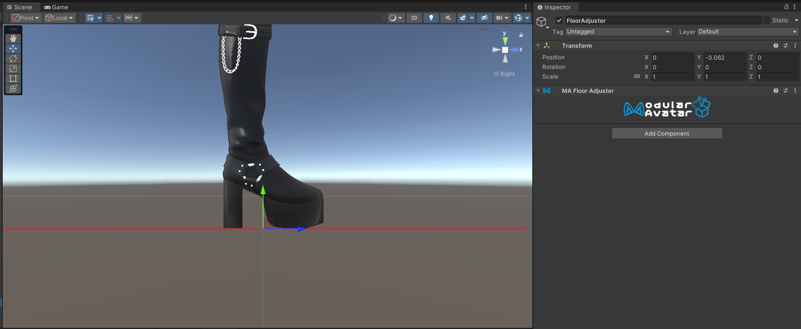
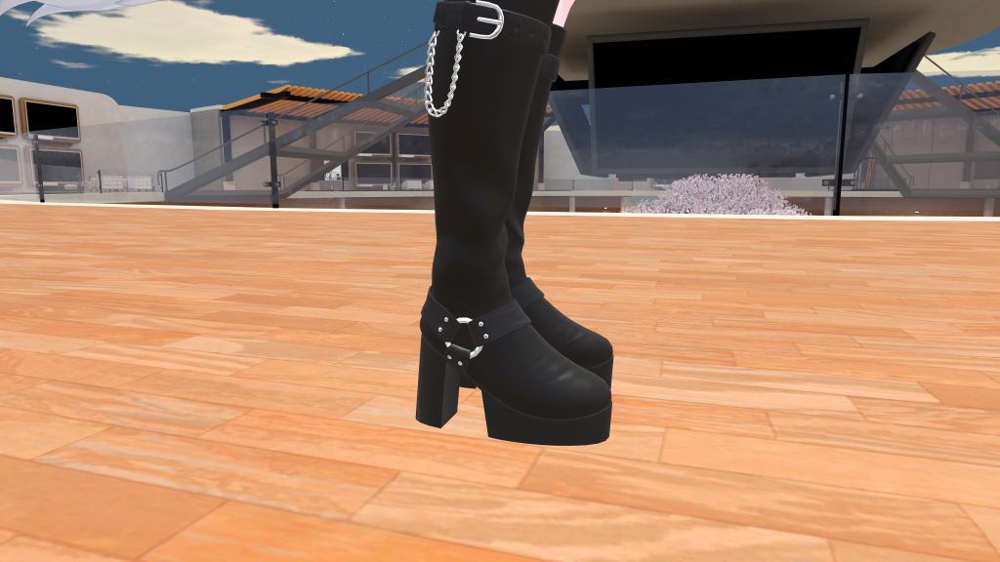

# Floor Adjuster

Floor Adjuster を使うことで、アバターの上下位置を調整して、靴底を床に合わせることができます。

## いつ使うべきか

靴をアバターに導入する時、靴が床にめり込まないようにアバターの高さを調整する必要がある場合があります。

  
  *Floor Adjuster前*

  
  *Floor Adjuster後*

## 非推奨の場合

VRChatでは、アバターの上下位置を動的に変更することができません。そのため、異なる高さの衣装を同じアバターに入れる
場合、すべてを合わせることができません。

## 使い方

新しいGameObjectを作って、Floor Adjusterコンポーネントを追加する。このオブジェクトの上下位置を、靴底に合わせます。

:::tip

シーンビューを横からの等尺視点にすると調整しやすいです。

:::

:::warning

VRChatでは、アバターの上下位置を動的に変えることができません。そのため、複数のFloor Adjusterが感知された場合、
調整が行われません。今後、アバターの上下位置を動的に変更することができたら、この仕様が見直される可能性があります。

:::

