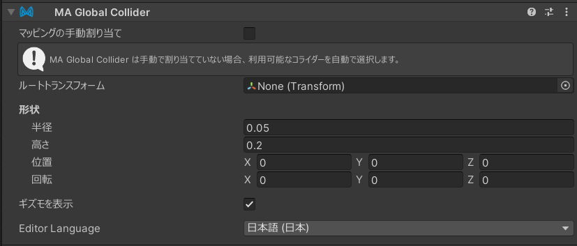

# Global Collider

`MA Global Collider` コンポーネントを使うことで、自分のアバターの中に他のアバターと干渉できるコライダーを
設定できます。

## いつ使うべきか？

ほかのアバターのダイナミックス（例：VRChat のPhysBones）に干渉できるギミックを作る時に便利です。

### 使用例

- ギミックや小道具にコライダーを追加して、他のアバターの PhysBone と相互作用させる。
- VRChat の手（Hand）コライダーの位置を移動して、掴み位置を変える（例えば口元に移動して噛むような表現をするなど）。
- コライダーを持ったゲームオブジェクトをアニメーションさせて、武器の反動や衝撃波の効果を表現する。

## いつ使うべきでないか？

プラットフォームによってはグローバルコライダーの数に制限があったり、使用するとパフォーマンスに悪影響が出る場合が
あります。したがって、このコンポーネントは必要最小限にとどめてください。特に、VRChatの場合は、６つ以上Global Colliderを
使用すると、人差し指のコライダーが上書きされるので注意が必要です。

## 何をするのか？

このコライダーは、Modular Avatar に対して「この Transform に対してグローバルコライダーを作る」よう指示します。
グローバルコライダーとは、他のアバターと干渉できるコライダーのことです。VRChatでは通常、指などの特定の組み込み
コライダーのみが他アバターと相互作用できます。

このコンポーネントは任意のゲームオブジェクトに置けます。標準的なカプセルコライダーやVRChatのPhysBone用コライダーと
同じように、形状を定義して使用できます。

実装の仕方はプラットフォームによって異なる可能性があります。VRChat 上ではグローバルコライダーの数が限られている
ため、このコンポーネントは既存のグローバルコライダー（指や手など）のいずれかを差し替えてグローバルコライダーを
実現します。

他のプラットフォームでは、別の方法で実装する場合があります。

## 手動割り当て

VRChat 上では、このトグルを有効にすると、どのコライダーを MA Global Collider が差し替えるかを手動で指定できます。
注意点として、一覧にある全てのコライダーが他アバターの PhysBone と物理的に衝突するわけではありません。
Head、Torso、Feet は「コンタクト送信のみ（contact sender）」であり、他アバターの PhysBone に対する物理的な衝突を
与えません。

## 低優先度コライダー

手動割り当てが有効な場合にのみ利用可能です。低優先度に設定された Global Collider は置き換え可能として
扱われます。同じコライダーを別の Global Collider がリマップした場合、低優先度の方は警告なしに上書きされます。