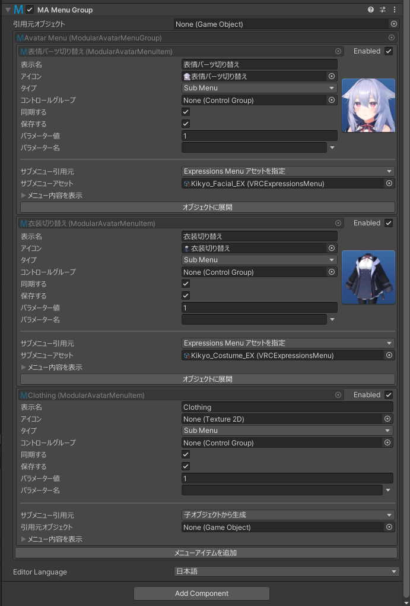

# Menu Group

Menu Groupコンポーネントは、単一のメニューインストーラーを使用して、複数のメニュー項目をサブメニューにグループ化せずにインストールできるようにします。

このコンポーネントは主にExpressions Menuの変換時に使用される内部コンポーネントとして設計されています。

## いつ使うの？

サブメニューに入れずに、複数のメニュー項目をインストールしたいときに使います。

## 使い方

デフォルトでは、Menu Groupコンポーネントが配置されているゲームオブジェクトの直下のすべてのMenu Itemを含みます。
Menu Itemのサブメニュー/子モードと同様に、ソースオブジェクトのオーバーライドを設定して、ほかの引用元オブジェクトを選択できます。