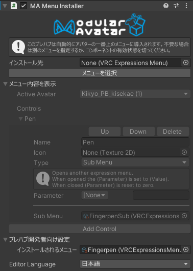

# Menu Installer

Menu Installerコンポーネントを使えば、アバターのエクスプレッションメニューに自動的に項目を追加することができます。

## いつ使うか

メニューに何かを追加したいとき！

## 使い方

### アセットユーザー

何もしなくても、プレハブのメニューがアバターのアクションメニューの一番上に導入されます。
それでいいなら、何もしなくても大丈夫です！場所を変えたい場合は「メニューを選択」を押して、インストールしたい場所をダブルクリック。

メニューがいっぱいになった場合は、自動的にサブメニューが生成されます。

インストールしないでほしい場合は、左上のチェックを外せば、インストールされなくなります。

### プレハブ開発者向け

まずは、追加したいコントロールを含んだExpressions Menuアセットを生成してください。インストール先のメニューに**統合**されます。
なので、サブメニューとして入れたいなら、そのサブメニューのほかに、サブメニューコントロールだけが入った追加用メニューアセットも作ってください。

プレハブに、[Parameters](parameters.md)コンポーネントと同じオブジェクトにMenu Installerを追加してください。
プレハブ開発者向け設定を開き、「インストールされるメニュー」に追加したいメニューを追加してください。

### ほかのアセットのメニューを拡張

ほかのMenu Installerでインストールされるメニューを拡張したい場合もあるかもしれません。
別のMenu Installerでインストールされるメニューを「インストール先」で指定することで拡張できます。