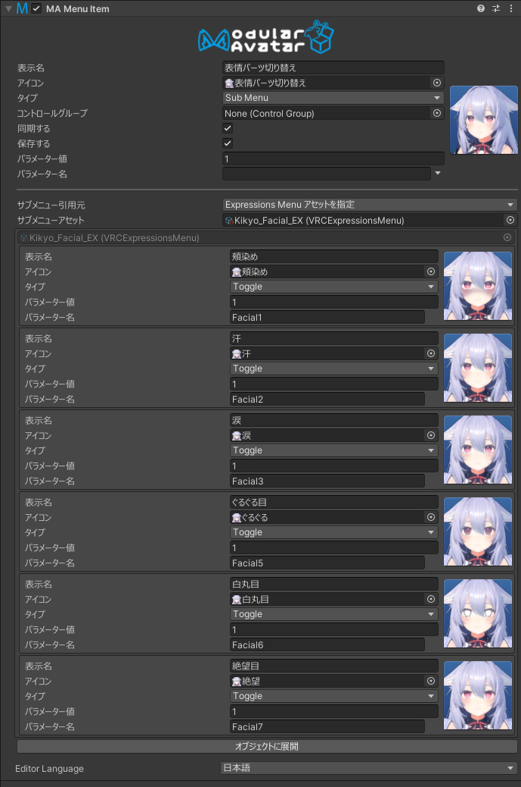
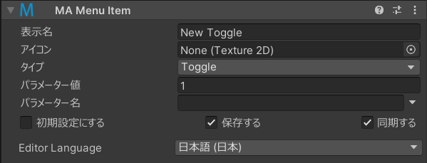

# Menu Item

MA Menu Itemコンポーネントは、Unityのヒエラルキー内でExpressions Menuのメニュー項目を定義できるようにします。

## いつ使うの？

このコンポーネントを使うことで、VRC Expressions Menuアセットで定義するよりも簡単にメニュー項目を定義できます。
ヒエラルキー内でメニュー項目をドラッグアンドドロップすることで、移動できたり、[MA Parameters](parameters)コンポーネントで定義されたパラメーター名を意識したエディターUIを提供します。

## どう使うの？

:::tip

メニューエディターの使い方については、[こちらのチュートリアル](/docs/tutorials/menu)をご覧ください。

:::

メニューアイテムコンポーネントは、メニュー内の単一の項目を定義します。
メニュー項目の名前は、ゲームオブジェクトの名前から取得されます。これでヒエラルキーからメニュー項目の名前を確認したり、名前を変更したりできます。

### サブメニューについて

メニュー項目をサブメニューとして設定すると、サブメニューの内容をどこから取得するかを設定できます。
サブメニューの引用元を「Expressions Menu アセットを指定」に設定し、通常のVRC Expressions Menuアセットを参照するか、
サブメニューの引用元を「子オブジェクトから生成」に設定し、このメニュー項目の直下にあるメニュー項目をサブメニューとして使用することができます。

サブメニューの項目数がVRCメニューの最大項目数を超える場合、自動的に「次へ」項目が作成され、メニューが分割されます。

サブメニューの引用元を「子オブジェクトから生成」に設定した場合、「引用元オブジェクト」を指定することもできます。指定する場合は、Menu Itemが追加されてるオブジェクトの子ではなく、指定したオブジェクトの子オブジェクトが使用されます。

### メニューの配置

メニュー項目をどこに配置するかを定義するために、他のコンポーネントを使用して配置させる必要があります。これは3つの方法で行うことができます。

* 「子オブジェクトから生成」モードでサブメニューを設定したメニュー項目の子に配置する。
* [Menu Installer](menu-installer)コンポーネントがあるゲームオブジェクトにメニュー項目を配置する。
* メニュー項目を[Menu Group](menu-group)オブジェクトの子に配置する（Menu Installerコンポーネントがあるゲームオブジェクトに配置される場合が多い）。

配置されないメニュー項目は効果がありません。

### パラメーターの自動生成

[MA Parameters](parameters.md)コンポーネントやVRC Expressions Parameterアセットで宣言されていないパラメーター名を指定すると、
Menu Itemはパラメーターを自動的に作成します。この場合、保存/同期されるかどうかを制御するためのチェックボックスが表示されます。

「初期設定にする」をクリックすると、このメニュー項目がこのパラメーターのデフォルトに設定されます。
複数のメニュー項目が「初期設定にする」に設定されている場合、結果は不定になるのでやめましょう。

メニュー項目にパラメーター名が設定されていない場合でも、これらのオプションが表示されます。
その場合、ここのメニュー項目によって制御される[Reactive Objects](./reaction/index.md)がある場合、パラメーターが自動作成されます。
