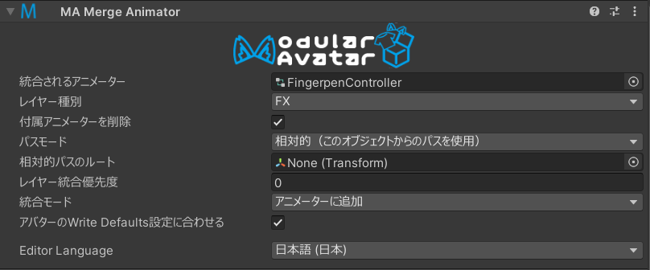
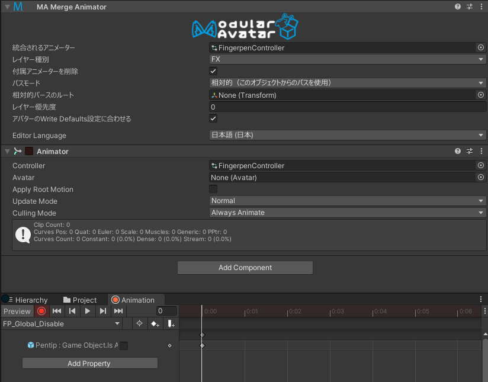

# Merge Animator

Merge Animatorコンポーネントは、指定したアニメーターをアバターの指定したレイヤーに追加します。
ドラッグアンドドロップだけで導入できるAV3ギミックを実装する時には便利です。

[このコンポーネントを使ったサンプル](/docs/samples/)も二つ付属します。手を合わせて叩くギミックと、指ペンが使えるギミックです。

## いつ使うもの？

アセットの中に、アバター本体のアニメーターに追加するコントローラーがあった場合に使います。

## 非推奨の場合

既存のレイヤーをそのままにして、指定したコントローラーを追加するだけです。完全に既存のアニメーターを置き換える場合は従来通り
ユーザーに差し替えてもらいましょう。

## セットアップ方法

Merge Animatorコンポーネントをプレハブの中の任意のオブジェクトに追加して、統合されるアニメーターに自分のアニメーターコントローラーを指定します。
そして、「レイヤー種別」をFXなど、アバターディスクリプタにあるアニメーター種別を指定します。

### アニメーションの収録

デフォルトでは、アニメーターの中のパスはMerge Animatorコンポーネントを基準に相対的に解釈されます。
Merge Animator以下のオブジェクトだけをいじる場合は、これでアニメーションの収録が簡単にできます。

GameObjectにAnimatorコンポーネントも追加して、Animationパネルでアニメーションを収録できます。

開発の補助として、「付属アニメーターを削除」を入れると、同じオブジェクト内のAnimatorが自動的に排除されます。
.
### ヒューマノイドボーンのアニメーション

ヒューマノイドボーンを操作するアニメーションは上記の相対的なパスで解釈されるのではなく、アバター全体に適用されます。
AFKアニメーションなどほとんどのヒューマノイドアニメーションがそのまま使えるというわけです。

### パスモード

パスモード設定に応じて、アニメーションのパスの扱いが変わります。「相対的」モードでは、アニメーションのパスが特定のオブジェクトを基準として解釈されます。これで移動されても動作するギミックが作れるし、アニメーションの収録がしやすくなります。デフォルトでは、コンポーネントがついているオブジェクトが基準になりますが、「相対的パスのルート」で変更できます。

自分のプレハブ外の、元々からあったオブジェクトを操作する場合は、「パスモード」を「絶対的」に変えてください。
これでアニメーターの中のパスがアバターを基準に解釈され、Merge Animatorから相対的に解釈されるシステムがはずされます。
上記の収録方法が使えなくなるわけです。

### レイヤー優先度

レイヤー優先度は、統合されるアニメーターが適用される順番を制御します。優先度が低いものから順にアニメーターが適用され、
高いものが低いものの効果を上書きします。
同じ優先度のMerge Animatorは、階層の順に適用されます。既存のアニメーターは、優先度がゼロと過程され、全てのゼロ優先度の
Merge Animatorよりも前に適用されます。

### 統合モード

デフォルトでは、Merge Animatorは指定したレイヤーにアニメーターを追加します。レイヤーを置き換えたい場合は、
「既存アニメーターを置き換える」にしてください。これで、VRChatアバターディスクリプタに設定されたアニメーターが、
指定されたアニメーターに置き換わります。

置き換わったアニメーターは、指定した優先度を保持しますが、同じ優先度の他のMerge Animatorよりも前に適用されます。

同じレイヤー種別で複数のアニメーターを「置き換える」設定にしてしまうとエラーになります。

### Write Defaults

デフォルトでは、アニメーターの中のWrite Defaults設定がそのまま使われます。アバターに合わせたい場合は、「アバターのWriteDefaults設定に合わせる」を入れてください。
アバターの既存アニメーターが一貫して同じWriteDefault設定を使っているかを判断して、それに合わせます。
なお、アバターがもともとからWD設定を混合している場合は、統合するアニメーターの設定をそのまま採用します。

## 制限

### VRCAnimatorLayerControl

現在、VRCAnimatorLayerControlのState Behaviorに関しては、単一アニメーター内のレイヤーを操作する場合のみに対応しています。
かならず`Playable`値がMergeAnimatorのレイヤー種別と同じになるようにして、`Layer`値を自分のアニメーター内のレイヤー番号にしてください。
