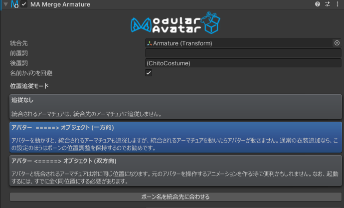
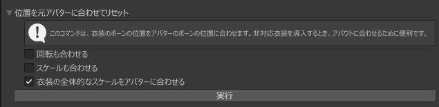

# Merge Armature

Merge Armatureコンポーネントは、GameObjectのツリーをアバターのアーマチュアに統合するコンポーネントです。

## いつ使うもの？

Merge Armatureは衣装アセット専用のもので、Skinned Mesh Rendererの調整や追加されるボーンを最小限にする特殊処理が入っています。
アバターのアーマチュアに追従するスキンメッシュを追加するときに使いましょう。

## 非推奨の場合

様々なアバターに対応する、汎用アセットには不向きです。例えば汎用型指ペンアセットは推奨できません（その代わりに[Bone Proxy](bone-proxy.md)を使いましょう）
元々想定したアバター以外には対応できないアセットとなります。

## セットアップ方法

統合させるヒエラルキーのルートにMerge Armatureコンポーネントを追加して、アバターの方の該当ボーン（統合先）を「統合先」に置きましょう。
「前置詞」「後置詞」は自動的に設定されます。

## 細かい仕様

追加されたGameObject以下のツリーをたどり、統合先の所から該当ボーンを名前で探します。
既存アセットの互換性を上げるため、統合先を探すときにはがされる前・後置詞も指定できます。

該当ボーンが見つかった場合は、統合元ボーンへの引用を統合先ボーンへ書き換えようとします。できない場合は、子にボーンが追加されます。
また、該当ボーンがない場合も、子にボーンが追加されます。

元々のヒエラルキーに設定されたコンポーネントがそのまま動作できるようにいろいろと工夫しています。特に、
* アニメーター引用が自動的に必要に応じて統合先に書き換えられます。Transformアニメーションは統合先に向かれたり、GameObjectのON/OFFがもともとの位置だったり。
* PhysBonesやContactはTarget欄が統合先のボーンに書き換えられます。PhysBone自体がMerge Armatureの外でもこの処理が施されます。 
* 他のコンポーネントは元々の位置のままで、コンストレイントで統合先の動きに追従します。

Transform以外のコンポーネントが入っているボーンがある場合、そのボーンが残ります。そのほかのボーンは原則として統合後に削除されます。
必要に応じてPhysBoneのターゲットが調整されたり、ParentConstraintが生成されることで、なんとなく動くようになります。

Modular Avatar 1.7.0以降、連鎖的に統合することができます。つまり、AをBに統合して、BをCに統合することができます。
統合参照に応じてModular Avatarが自動的に統合順序を計算します。

## 位置追従モード

位置追従モードは、編集モードでベースアバターの動きに追従するようにする機能です。アニメーション制作やポーズの確認、スクリーンショットの
撮影などに便利です。3つのモードがあります。

* 追従なし - 編集モードでベースアバターの動きに追従しません。
* アバター =======> ターゲット（一方向） - ベースアバターが動くと衣装も動きます。衣装を動かしてもベースアバターは動きません。
このモードは衣装のフィット調整を保持すので、通常の衣装導入なら推奨です。
* アバター　\<======> ターゲット（双方向） - ベースアバターが動くと衣装も動きます。衣装を動かすとベースアバターも動きます。
このモードは、ベースアバターの髪やケモミミを動かすアニメーションを作るなど、高度な用途向けです。

「Setup Outfit」で衣装を導入すると、位置追従モードは「アバター =======> ターゲット（一方向）」に自動設定されます。
必要に応じてインスペクタで変更してください。

## 位置を元アバターに合わせてリセット

非対応衣装を導入する時は、まず大まかに位置を合わせてから微調整すると便利です。Merge
Armatureの設定UIの中の、「位置を元アバターに合わせてリセット」ツールがそのための機能です。

「実行」を押すと、衣装のボーンの位置がベースアバターのボーンの位置に合わせられます。そのほか、以下の追加オプションもあります。

* 「回転も合わせる」 各ボーンのローカル回転もベースアバターのボーンの回転に合わせます。特殊な用途向けです。特に、衣装がベースアバターと同じ3Dソフトで作られていない場合は、不自然な挙動になります。
* 「スケールも合わせる」 各ボーンのローカルスケールもベースアバターのボーンのスケールに合わせます。ベースアバターのボーンのスケールを調整している場合に使います。
* 「衣装の全体的なスケールをアバターに合わせる」
  衣装全体のスケールをベースアバターに合わせます。アバターの腕の長さから全体の大きさを決め、位置合わせをする前に衣装全体を拡大・縮小します。非対応衣装セットアップ向けです。

オプションの設定は保存されません。「実行」を押す時一回だけ適用されます。

## オブジェクト引用

エディタ上では統合先をドラッグアンドドロップで指定しますが、内部ではパスで保存されます。プレハブ化してもちゃんと統合先を保存できるということです。

## ボーン名合わせ

Merge Animatorがボーンを名前で照合するので、つけるだけでは非対応衣装がうまく動かない場合があります。
対策として、「ボーン名を統合先に合わせる」ボタンを押すことで、衣装側のボーン名を自動的にアバターのボーン名に合わせようとします。
なお、「Setup outfit」でMerge Armatureをつける場合はこの処理が自動的に走ります。

## 名前かぶりを回避

統合先と一致する名前のボーンがある場合は統合しますが、統合元のボーンのうち統合先にないものは名前を変更した上で配置します。
これは、統合先と偶然同じ名前のボーンがある他のアセットと衝突することを避けるためです。

特殊な場合でこの処理を無効にしたい場合は「名前かぶりを回避」のチェックを外してください。