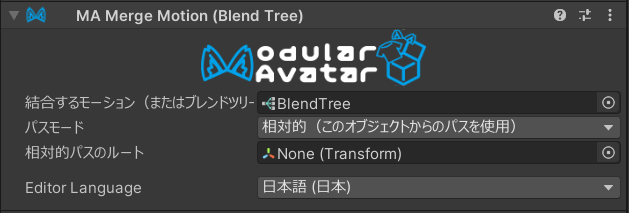

# Merge Blend Tree

Merge Blend Treeは、複数のブレンドツリーを1つのFXレイヤーにマージすることができます。
複数のギミックを1つのレイヤーにまとめて、負荷を低減するための高度なコンポーネントです。

## いつ使うもの？

ブレンドツリーを常にアバターで稼働させたい場合に使います。

## いつ使わないもの？

ブレンドツリーを無効にしたり、モーションタイムを制御したりする必要がある場合は、Merge Blend Treeを使わないでください。

## セットアップ方法

まず、ブレンドツリーのアセットを作成します。プロジェクトウィンドウで右クリックして、Create -> BlendTreeを選択してください。

ブレンドツリーを設定したら、Merge Blend Treeコンポーネントを追加して、「ブレンドツリー」フィールドに指定します。

パスモードと相対パスルートは、Merge Animatorと同様に設定できます。
詳細は、[Merge Animatorのドキュメント](merge-animator.md)を参照してください。

## ブレンドツリーのマージ方法

Modular Avatarは、FXコントローラーの一番上に新しいレイヤーを作成します。
このレイヤーには、Write Defaultsがオンになっている単一のステートが含まれています。
マージされたブレンドツリーは、パラメーターが常に1に設定されているこのDirect Blend Treeに接続されます。