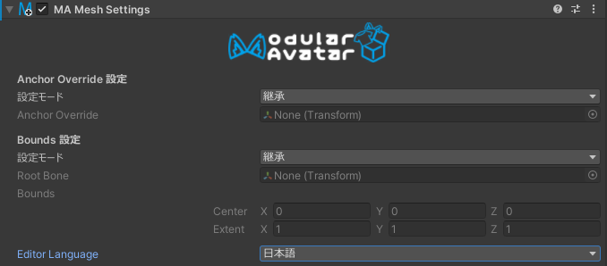

# Mesh Settings

Mesh Settingsコンポーネントを使用すると、特定のゲームオブジェクトの配下にあるすべてのメッシュに対して、特定のメッシュ設定
（アンカーオーバーライドとバウンズ）を設定できます。

## いつ使うべきか

このコンポーネントをアバターの最上位レベルに配置すると、アバター内のすべてのメッシュに対してバウンズとライトプローブアンカーが
一貫して設定されるようになります。

「Setup Outfit」機能は、新しく追加されたアウトフィットに自動的にMesh Settingsコンポーネントを自動的に設定します。

最後に、Mesh Settingsは、階層の上位にあるMesh Settingsの影響を受けないように、メッシュを除外するためにも使用できます。

## いつ使うべきでないか

配布用のアセットにバウンズやライトプローブを設定する時は注意が必要です。なぜなら、これらの設定がアバターと一致しない可能性が
あります。一般的に、特定のアバター用に設計されたアセットの場合のみ設定を推奨します。

## Mesh Settingsの手動設定

ゲームオブジェクトにMesh Settingsを追加すると、最初は何も効果がありません。効果を発揮するには、まずは「Anchor Override
設定」あるいは
「Bounds 設定」で「設定モード」を変更する必要があります。以下の選択しがあります。

- 継承：このコンポーネントはこの設定に対して何もしません。親のMesh Settingsで設定された値を継承します。
- 設定：このコンポーネントは、そのゲームオブジェクトとその子にあるメッシュの対応する設定を設定します。
- 設定しない：このコンポーネントは、親のMesh Settingsの影響を受けないようにします。メッシュはデフォルトの設定のままです。
- 親が継承された時は継承、または設定：親のMesh Settingsが設定モードにある場合、それが使用されます。親のMesh
  Settingsが適用されない場合、
  このコンポーネントの設定が使用されます。衣装プレハブなどに、アバター全体の設定が優先されるようにするために便利です。

バウンズを設定する場合、バウンディングボックスは「Root Bone」として指定したトランスフォームに対して相対的に決定されます。
また、バウンズはSkinned Mesh Rendererのみに影響しますが、Anchor OverrideはMesh RendererやLine Rendererなどの他のタイプの
Rendererにも設定されます。