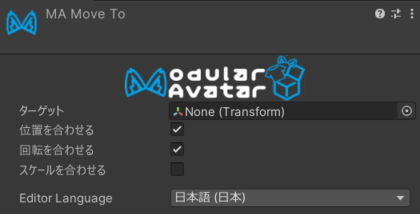

# Move To

Move Toは、アバター内の別のオブジェクトのトランスフォームに合わせてオブジェクトを移動します。ビルド時に一旦所定の位置に
動かしたいが、動的に追尾して欲しくない場合に便利です。

## Move Toの設定方法

移動させたいオブジェクトにMove Toコンポーネントを追加し、アバター内のオブジェクトを**ターゲット**に指定します。
合わせるトランスフォームの項目を選択してください。

- **位置を合わせる**: オブジェクトのワールド位置をターゲットに合わせます。
- **回転を合わせる**: オブジェクトのワールド回転をターゲットに合わせます。
- **スケールを合わせる**: 親オブジェクトのスケールが異なる場合も含め、オブジェクトのスケールをターゲットに合わせます。

Move Toは編集時に継続してオブジェクトを更新します。アバターをビルドする時はBone Proxyの処理後に一度だけ選択した項目を
適用し、ビルド済みアバターから自身を削除します。
