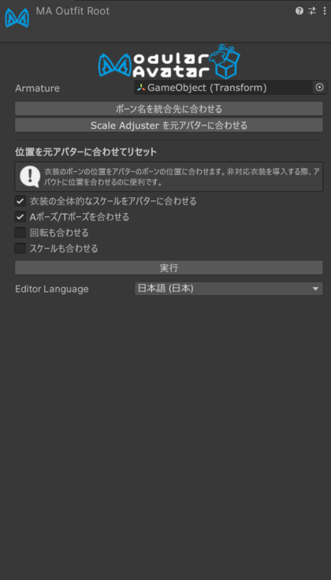

# Outfit Root

Outfit Rootコンポーネントは、衣装のルートGameObjectを示します。

## Outfit Rootとは？

[Setup Outfit](/docs/tutorials/clothing/)を実行すると、選択した衣装オブジェクトにOutfit Rootが自動的に追加され、
アーマチュアルートが設定されます。通常、このコンポーネントを手動で追加・設定する必要はありません。

:::note

以前のバージョンのModular Avatarを使用して設定された衣装に対してSetup Outfitを実行する場合も、Outfit Rootコンポーネント
が自動的に追加されます。

:::

Outfit Rootを手動で追加する場合は、**アーマチュアルート**に衣装のメインボーンヒエラルキーのルートTransformを指定してください。

Outfit Root自体が直接何かを処理することはありません。通常はヒエラルキーの奥にあるオプションへ簡単にアクセスできるようにし、
ほかのツールが衣装を識別するためのマーカーとして使うことを目的としています。

## 衣装調整ツール

Outfit Rootのインスペクターから、衣装のフィットを調整するオプションへ簡単にアクセスできます。

- **ボーン名を統合先に合わせる**は、衣装のボーン名を素体のボーン名に合わせて変更します。
- **位置を元アバターに合わせてリセット**は、アーマチュアルート以下にあるすべてのMerge Armatureについて、対応する衣装のボーンを
  素体のボーン位置に移動します。Aポーズ・Tポーズの変換、衣装全体のスケール調整、ボーンの回転やローカルスケールのコピーも選択できます。
- **Scale Adjusterを元アバターに合わせる**は、対応する衣装ボーンの[Scale Adjuster](scale-adjuster.md)コンポーネントを
  追加・更新・削除し、素体と同じ設定にします。
