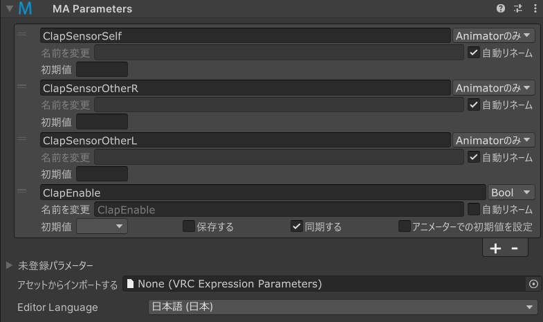

# Parameters

Modular AvatarのParameters コンポーネントで、ギミックが内部で使ってたり、外とやり取りするためのパラメーターを定義できます。
衝突を避けるために名前を変更したり、同期・非同期パラメーターとその初期値を設定できます。

## いつ使うもの？

VRChatが提供するパラメーター以外の、自分で定義するパラメーターを使うギミックを作る際に使います。

## 使い方

### 初期値を設定する

ParametersのUIは最初はたたんだ状態でパラメーター情報を表示します。この表示では初期値と、アバター変更やワールド移動でで保存されるかを
設定できます。空以外の設定だと、Expressions Parametersに設定された初期値も上書きします。

複数のMA Parametersで同じパラメーターが設定された場合は、初期値を空欄にするのが便利です。設定されたところだけ初期値に関与します。
なお、複数のMA Parametersコンポーネントで同じパラメーターの初期値を設定してしまうと初期値が不定になるため注意がでます。

「保存する」設定に関しては、どれか一つのMA Parametersで有効になっている場合は保存状態となります。しかし、例外もあります。詳しくは
「入れ子にする」に参照。なお、Expressions ParametersとMA Parameters両方に定義される場合は、MA Parametersが優先されます。

### 名前を変更

「名前を変更」欄に新しい名前を入れると、パラメーターのリネームができます。たとえば、「hoge」という名のパラメーターに、「piyo」という
「名前を変更」設定を入れると、MA Parametersコンポーネントのあるオブジェクトとその子では「hoge」として参照できます。その中の
[MA Menu Item](menu-item.md)、[MA Merge Animator](merge-animator.md)、VRChat Contact Receiverなどは「hoge」で扱うわけです。
しかし、そのオブジェクトの外では、「piyo」として扱われます。

複数のMA Parametersで名前がかぶるように設定すると、一つのギミックで別のギミックを制御するように連動させることができたりします。
また、「自動リネーム」を設定すれば、Modular Avatarに自動的に衝突しない名前を選択してもらえます。これで意図してない名前の衝突を避ける
ことができます。

### パラメーターの新規作成

新規のパラメーターを作る方法がふたつです。まず、リストの下の「+」を押してから、作られたパラメーターの左の▶を押して、パラメーター名を
記入することです。

また、「未登録パラメーター」のところを開いて登録することもできます。このリストには、このオブジェクトとその子で検出されている未登録
パラメーターがリストアップされます。「追加」を押せばワンクリックで登録できるし、虫眼鏡牡丹をクリックすると検出された場所が表示されます。

どのみち、パラメーターを作ったら▶を押せば詳細画面を開けます。そこで同期状態をつかさどるパラメーター型を設定したり、その他詳細設定ができます。

### PhysBoneやContact

MA ParametersはVRC Phys BoneやContact Receiverコンポーネントにも対応しています。PhysBonesの場合は、VRC Phys Boneコンポーネント
の「Parameter」欄にも登録されている、前置詞をパラメーター名にしてから、「PhysBone前置詞名」を有効にしてください。なお、
「未登録パラメーター」のリストから追加する場合は自動的に設定されます。

### Expression Parameters

VRC Expression Parametersに登録する場合は、「パラメーター型」を設定してください。ネットワーク経由で同期されるようになり、
Expressions Menu（アクションメニュー）やOSCで使えるようになります。ネットワーク同期が不要の場合は「Local Only」を設定してくささい。

### 入れ子にする

MA Parametersコンポーネントは入れ子状態にできます。これで複雑なシステムを、複数のモジュールから組み上げることができます。
MA Parametersコンポーネントはそれぞれ、その子に名前変更を施します。例えば、中のほうのMA Parametersが「hoge」→「piyo」でリネームし、
外が「piyo」を自動リネームするとしたら、その間のオブジェクトでは「piyo」としてアクセスできます。

入れ子にした場合の特別の取り扱いが一部あります。

* 「保存する」設定は、親側で登録された設定を優先します。ただし、入れ子になってないMA Parametersで「保存する」設定が異なる場合は、
  どれか一つでも「保存する」が有効になった場合は有効になります。
* 「初期値」設定は、親側で登録された設定を優先します。ただし、親の設定が空欄の場合は子の設定を考慮する。なお、入れ子になってない状態で
  「初期値」設定が異なる場合は初期値が不定になるため注意が表示されます。