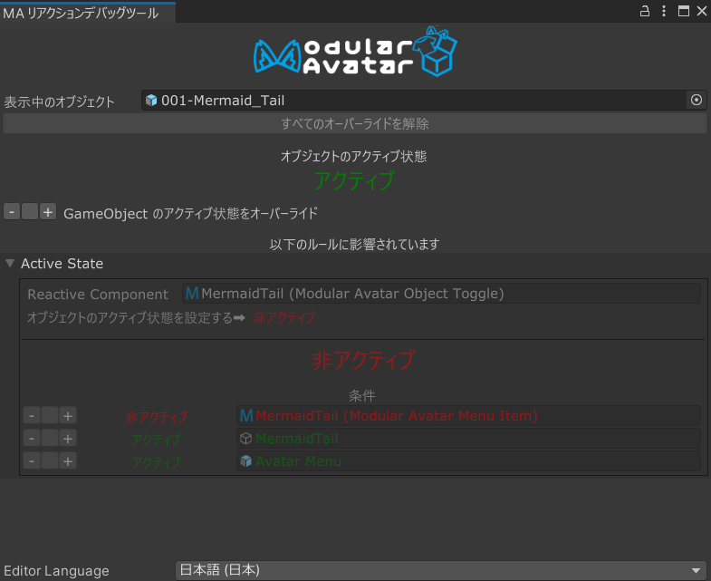
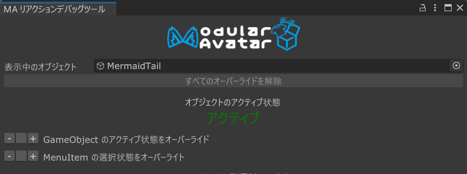
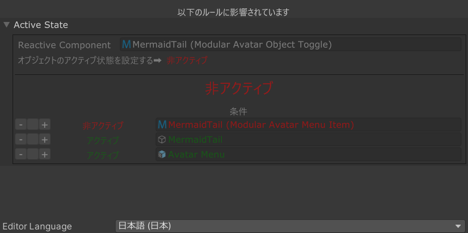

---
sidebar_position: 900
---

# Reaction デバッガー

Reactive Component デバッガーとは、メニューアイテムやゲームオブジェクトの状態を仮想的に変更することができるツールです。
これにより、アバターのヒエラルキー上の状態を変えずに、リアクティブコンポーネントの挙動をテストすることができます。

Reactive Component デバッガーを開くには、ゲームオブジェクトを右クリックし、`Modular Avatar -> Show Reaction Debugger` を選択してください。
または、リアクティブコンポーネントの `Open reaction debugger` ボタンをクリックすることでも開くことができます。。

デバッガーウィンドウは2つのセクションに分かれています。1つはオブジェクト自体の状態を表示し、もう1つはそのオブジェクトに影響を与えるリアクションを表示します。

## オブジェクト状態セクション

上部セクションでは、調査したいオブジェクトを選択することができます。`Inspecting object` 欄を変更することで調査するオブジェクトを変更できます。
デフォルトでは、現在選択されているオブジェクトが表示されますが、変更することで代わりのオブジェクトを調査することもできます。
インスペクターウィンドウと同様に、ロックボタンを押して、シーンビューで異なるオブジェクトを選択しても変更されないようにすることができます。

`Inspecting object` 欄の下には、すべてのオーバーライドを解除するボタンがあります。`Object state: ACTIVE` と表示されているのは、
このオブジェクトが（仮想的に）アクティブであることを示しています。

その下には、オブジェクトを強制的にアクティブ/非アクティブにするオプションや、関連するメニューアイテムを選択/選択解除するオプションがあります。
`-` または `+` ボタンをクリックすることでオーバーライドを設定できます。中央（空白）ボタンをクリックするとオーバーライドを解除できます。

オブジェクトを「アクティブ」または「非アクティブ」に強制することは、実際にはヒエラルキー上の状態を変更するわけではありませんが、
シーンビュー上ではそのように表示されます。

## リアクションセクション

リアクションセクションでは、選択したオブジェクトに影響を与えるリアクションが表示されます。また、そのリアクションがトリガーされるために必要な条件を表示して、
オーバーライドするためのボタンもあります。
