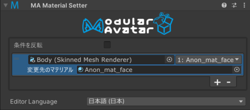

# Material Setter

Material Setter コンポーネントは、Material Setter コンポーネントの GameObject が有効になっているときに、アバター内のほかのレンダラーの
マテリアルを変更します。

Material Setter は [リアクティブコンポーネント](./index.md) の一種です。リアクティブコンポーネントの一般的なルールと動作については、
[リアクティブコンポーネント](./index.md) ページを参照してください。

## いつ使うべきか？

Material Setter は、オブジェクトのマテリアルを変更するために使用できます。Menu Item の動作、もしくは他のオブジェクトの表示/非表示に応じて、
オブジェクトのマテリアルを変更することができます。

## Material Setter の設定

Material Setter コンポーネントを、その状態を制御する GameObject にアタッチします。アタッチするオブジェクトは、アニメーションで有効/無効になる
オブジェクトであってもよいし、Menu Item（またはその子オブジェクト）であってもよいです。また、常に有効のオブジェクトにつけることで固定で
マテリアルを変更することもできます。

次に、新しいエントリを追加するために + ボタンをクリックします。操作したいレンダラーを上部のオブジェクト欄にドラッグし、その右側のドロップダウン
ボックスから変更したいマテリアルスロットを選択します。最後に、挿入したいマテリアルを「変更先のマテリアル」欄に入れます。

デフォルトでは、Material Setter は GameObject が有効になっているとき（および/または関連するメニューアイテムが選択されているとき）に
マテリアルを変更します。GameObject が無効になったときにマテリアルを変更したい場合は、「条件を反転」を選択してください。