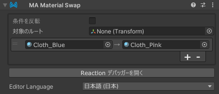

# Material Swap

Material Swap コンポーネントは、Material Swap コンポーネントの GameObject が有効になっているときに、
アバター内のマテリアルを別のマテリアルに一括で置換します。

Material Swap は [リアクティブコンポーネント](./index.md) の一種です。リアクティブコンポーネントの一般的なルールと動作については、
[リアクティブコンポーネント](./index.md) ページを参照してください。

## いつ使うべきか？

Material Swap は、アバター内のマテリアルを一括で置換するために使用できます。Menu Item の動作、もしくは他のオブジェクトの表示/非表示に応じて、
アバター内のマテリアルを一括で置換することができます。

Material Setter では変更対象のレンダラーを指定するのに対し、Material Swap では置換対象のマテリアルを指定します。

## Material Swap の設定

Material Swap コンポーネントを、その状態を制御する GameObject にアタッチします。アタッチするオブジェクトは、アニメーションで有効/無効になる
オブジェクトであってもよいし、Menu Item（またはその子オブジェクト）であってもよいです。また、常に有効のオブジェクトにつけることで固定で
マテリアルを置換することもできます。

次に、新しいエントリを追加するために + ボタンをクリックします。
置換元のマテリアルを上部のマテリアル欄にドラッグし、置換先のマテリアルを下部のマテリアル欄にドラッグします。

デフォルトでは、Material Swap は GameObject が有効になっているとき（および/または関連するメニューアイテムが選択されているとき）に
マテリアルを置換します。GameObject が無効になったときにマテリアルを置換したい場合は、「条件を反転」を選択してください。