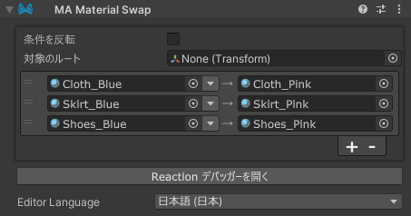

# Material Swap

Material Swap コンポーネントは、Material Swap コンポーネントの GameObject が有効になっているときに、
アバター内のマテリアルを別のマテリアルに一括で置換します。

Material Swap は [リアクティブコンポーネント](./index.md) の一種です。リアクティブコンポーネントの一般的なルールと動作については、
[リアクティブコンポーネント](./index.md) ページを参照してください。

## いつ使うべきか？

Material Swap は、アバター内のマテリアルを一括で置換するために使用できます。Menu Item の動作、もしくは他のオブジェクトの表示/非表示に応じて、
アバター内のマテリアルを一括で置換することができます。

Material Setter では変更対象のレンダラーを指定するのに対し、Material Swap では置換対象のマテリアルを指定します。

## Material Swap の設定

Material Swap コンポーネントを、その状態を制御する GameObject にアタッチします。アタッチするオブジェクトは、アニメーションで有効/無効になる
オブジェクトであってもよいし、Menu Item（またはその子オブジェクト）であってもよいです。また、常に有効のオブジェクトにつけることで固定で
マテリアルを置換することもできます。

次に、新しいエントリを追加するために + ボタンをクリックします。
置換元のマテリアルを左のマテリアル欄にドラッグし、置換先のマテリアルを右のマテリアル欄にドラッグします。

対象を特定の階層下のみに限定にしたい場合は、「対象のルート」を指定してください。

デフォルトでは、Material Swap は GameObject が有効になっているとき（および/または関連するメニューアイテムが選択されているとき）に
マテリアルを置換します。GameObject が無効になったときにマテリアルを置換したい場合は、「条件を反転」を選択してください。

## クイックスワップ

Material Swap の「クイックスワップ」機能を使うことで、異なるマテリアルを素早く切り替え、アバター上での見た目を
プレビューできます。マテリアルのプロジェクト内の構成によって、いくつかの検索モードがあります。

- **なし**: クイックスワップモードを無効にします。
- **同じフォルダー**: 現在の置換後のマテリアルと同じディレクトリ内のマテリアルを検索します。
- **隣接フォルダー**: 隣接するフォルダー内で、類似の名前のマテリアルを検索します。
  例えば、現在のマテリアルが `Assets\SomeOutfit\Materials\Blue\Outer.mat` の場合、`Assets\SomeOutfit\Materials\Red\Outer.mat`
  のようなマテリアルを検索します。このモードは、同じ衣装の別部位のマテリアルが、色違いなどでフォルダー分けされているとき
　に便利です。

どちらのモードを使用するか迷った場合は、両方試してみて、どちらが衣装に適しているか確認してください。

クイックスワップが有効になっていると、Material Swap コンポーネントのインスペクターに、変更先マテリアルの横に2つの矢印が表示されます。
この矢印をクリックすることで、次または前のマテリアルに素早く切り替えることができます。