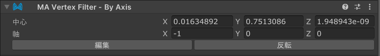

# Vertex Filter - By Axis

`Vertex Filter - By Axis`は、[Mesh Cutter](./)と組み合わせて使用する頂点フィルターコンポーネントであり、
平面の片側にあるかどうかに基づいて、メッシュの一部を削除または非表示にすることができます。

## いつ使うべきですか？

一つの一般的な使用例として、メッシュの片側を選択するために使用します。
例えば、リボンメッシュが左右で同じテクスチャ座標を使用している場合、`By Mask`フィルターを使用してリボン全体を選択し、
`By Axis`フィルターを使用して片側のみに制限できます。

## 非推奨の場合

配布用のアセットを制作する際、注意が必要です。利用者が `Scale Adjuster` などを使うと素体が変形し、選択された範囲が
変わる場合があるから、`By Axis` をおおざっぱな範囲選択（全体的に左か右かなど）のみに利用し、細かい選択を
[`By Mask`](by-mask.md)などほかの頂点フィルターで選択することをお勧めします。

## Vertex Filter - By Axisのセットアップ

`Vertex Filter - By Axis`は、[Mesh Cutter](./)コンポーネントを持つGameObjectに追加する必要があります。
Mesh Cutterコンポーネントの「頂点フィルターを追加」ボタンをクリックするか、手動で`Vertex Filter - By Axis`コンポーネント
を追加してください。

追加したら、`Edit`ボタンをクリックしてジズモを表示し、`By Axis`平面の位置と向きを調整できます。
平面は無限であり、空間を二つの半分に分割します。平面の一方の側にある頂点が選択され、もう一方の側にある頂点は選択されません。
白い矢印のジズモは、削除される側の平面を示しています。

`Center`と`Axis`フィールドは、レンダラーのローカル空間で解釈されます。