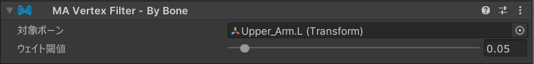

# Vertex Filter - By Bone

`Vertex Filter - By Bone`は、[Mesh Cutter](./)と組み合わせて使用する頂点フィルターコンポーネントであり、
特定のボーンに対する頂点のボーンウェイトに基づいて、メッシュの一部を削除または非表示にすることができます。

## Vertex Filter - By Boneのセットアップ

`Vertex Filter - By Bone`は、[Mesh Cutter](./)コンポーネントを持つGameObjectに追加する必要があります。Mesh Cutterコンポーネントの「頂点フィルターを追加」ボタンをクリックするか、手動で`Vertex Filter - By Bone`コンポーネントを追加してください。

### 設定

- **対象ボーン**: フィルタリングしたいボーンのトランスフォームを選択します。このボーンにウェイトが付いている頂点のみが考慮されます。
- **ウェイト閾値**: 頂点が選択されるために必要な最小ボーンウェイト値を設定します（0.0〜1.0）。対象ボーンに対してこの閾値以上のボーンウェイトを持つ頂点がフィルタリングされます。
    - ウェイトはノーマライズされた価を基準としています。

### 動作原理

このフィルターは各頂点のボーンウェイトを調べ、指定されたボーンに対して閾値を満たすかそれを上回るウェイトを持つ頂点を選択します。これにより、スケルタルバインディングに基づいてメッシュのどの部分が影響を受けるかを細かく制御できます。

例：
- 閾値を0.01に設定すると、そのボーンに意味のあるウェイトを持つ頂点が選択されます
- 閾値を0.5に設定すると、主にそのボーンに制御されている頂点のみが選択されます
- 閾値を1.0に設定すると、完全にそのボーンに制御されている頂点のみが選択されます

注意: このフィルターはボーンウェイトデータを持つSkinned Mesh Rendererでのみ動作します。通常のMesh Rendererやボーンウェイトを持たないメッシュでは効果がありません。