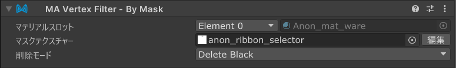

# Vertex Filter - By Mask

`Vertex Filter - By Mask`は、[Mesh Cutter](./)と組み合わせて使用する頂点フィルターコンポーネントであり、
マスクテクスチャに基づいてメッシュの一部を削除または非表示にすることができます。

## Vertex Filter - By Maskのセットアップ

`Vertex Filter - By Mask`は、[Mesh Cutter](./)コンポーネントを持つGameObjectに追加する必要があります。
Mesh Cutterコンポーネントの「頂点フィルターを追加」ボタンをクリックするか、手動で`Vertex Filter - By Mask`コンポーネント
を追加してください。

追加したら、Mesh Cutterコンポーネントの`対象のレンダラー`欄が変更したいオブジェクトに設定されていることを確認してください。
次に、削除したいポリゴンの`マテリアルスロット`を選択します。

:::note

単一の`Vertex Filter - By Mask`コンポーネントは、単一のマテリアルスロットからのみポリゴンを選択できます。
複数のマテリアルスロットからポリゴンを削除したい場合は、複数のGame Objectを作成し、それぞれに独自のMesh Cutterと
頂点フィルターを追加できます。

:::

マテリアルスロットを選択したら、`マスク`テクスチャを設定できます。
ここには既製のテクスチャを配置するか、[Mask Texture Editor](https://github.com/nekobako/MaskTextureEditor)をインストールし、
`編集`ボタンをクリックしてUnityエディタ内でマスクテクスチャを直接作成または編集できます。

最後に、`削除モード`欄を使用して、マスクの白または黒の領域を削除するかを選択できます。