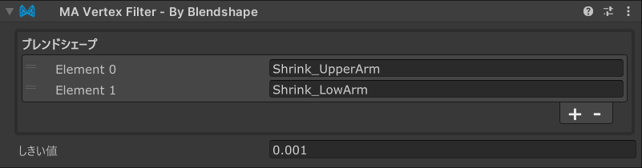

# Vertex Filter - By Blendshape

`Vertex Filter - By Blendshape`は、[Mesh Cutter](./)と組み合わせて使用する頂点フィルターコンポーネントであり、
特定のブレンドシェイプがアクティブになったときに頂点が動くかどうかに基づいて、メッシュの一部を削除または非表示にすることができます。

## いつ使うべきですか？

`Vertex Filter - By Blendshape`は、特定のブレンドシェイプがアクティブになったときに衣服やアクセサリーを貫通してしまう
メッシュの部分を削除したい場合に便利です。一般的な使用例には以下があります：

- 表情変化で顔の形が変わった際に、衣服を貫通して見えてしまうボディメッシュの部分を削除する
- 頭部のブレンドシェイプがアクティブになった際に、帽子を貫通してしまう髪の部分を隠す
- ブレンドシェイプベースのアニメーションに干渉するアクセサリーの部分を削除する

## Vertex Filter - By Blendshapeのセットアップ

`Vertex Filter - By Blendshape`は、[Mesh Cutter](./)コンポーネントを持つGameObjectに追加する必要があります。
Mesh Cutterコンポーネントの「頂点フィルターを追加」ボタンをクリックするか、手動で`Vertex Filter - By Blendshape`コンポーネント
を追加してください。

コンポーネントを追加したら、Mesh Cutterコンポーネントの Target Renderer フィールドが、変更したいオブジェクトに
設定されていることを確認してください。

次に、選択したいブレンドシェープを選択しましょう。「＋」ボタンを押すと、指定したメッシュから選択できるUIがでます。
複数選択した場合、そのどれかのブレンドシェープに操作される頂点がすべて選択されます。

最後に、`Threshold`値を調整して感度をコントロールします。ブレンドシェイプが完全にアクティブになったときに
この距離（ローカル空間内）以上動く頂点がフィルタリングされます。デフォルト値の0.001は多くの場合に適していますが、
特定のメッシュやブレンドシェイプによっては調整が必要な場合があります。

:::tip

より選択的に頂点をフィルタリングしたい場合は小さな閾値を、より積極的にフィルタリングしたい場合は大きな値を使用してください。

:::