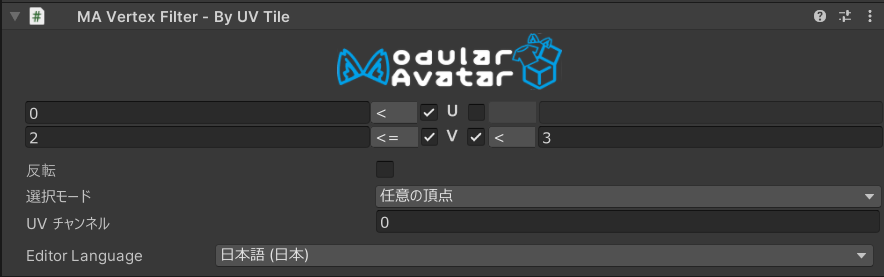

# Vertex Filter - By UV Tile



`Vertex Filter - By UV Tile` は、[Mesh Cutter](./) と組み合わせて使用する頂点フィルターコンポーネントで、UV 座標が指定された矩形領域内にあるかどうかに基づいて、メッシュの一部を削除または非表示にできます。

## いつ使うべきですか？

`Vertex Filter - By UV Tile` は、テクスチャ空間の座標に基づいてメッシュの特定領域を選択したい場合に便利です。一般的なユースケースは次のとおりです：

- UV タイル / UDIM テクスチャレイアウト上の個別のタイルを選択する
- UV マップ上の特定領域を占めるメッシュ部分を削除する
- 交差モードで他の頂点フィルターと組み合わせて、メッシュの可視領域を選択する

## 非推奨の場合

UV 座標が反復している場合（メッシュの左側と右側で UV がミラーリングされている場合など）、`By UV Tile` フィルターは左右両方の領域を同時に選択します。そのような場合は、[`By Axis`](by-axis.md) を使用して両側を区別することを検討してください。

## Vertex Filter - By UV Tile のセットアップ

`Vertex Filter - By UV Tile` は、[Mesh Cutter](./) コンポーネントと同じ GameObject にアタッチする必要があります。Mesh Cutter コンポーネントの "Add Vertex Filter" ボタンをクリックして追加するか、手動で `Vertex Filter - By UV Tile` コンポーネントを追加できます。

### 設定

各 UV 座標（U および V）について、下限と上限を設定して矩形選択領域を定義できます。各バウンドには 3 つのコントロールがあります：

- **有効トグル** — バウンドを有効または無効にします。無効にしたバウンドは無視され、U のみ、V のみ、または両軸でのフィルタリングが可能です。
- **演算子** — バウンドが strict（`<`）か inclusive（`<=`）かを選択します。strict の場合は境界値上の頂点を除外します。
- **値** — バウンドの座標値です。

左側のバウンドは最小値として機能し（この値より小さい U を持つ頂点は除外されます）、右側のバウンドは最大値として機能します（この値より大きい U を持つ頂点は除外されます）。

| フィールド | 説明 |
|---|---|
| **UV Channel** | 使用する UV セット（0～7）。デフォルトはチャンネル 0（最初の UV セット）。 |
| **Selection Mode** | 頂点選択をプリミティブ（三角形）選択に変換する方法を制御します。以下を参照。 |
| **Invert** | チェックすると、矩形の**外側**の頂点が選択されます。 |

### 選択モード

**Selection Mode** フィールドは、フィルターが三角形（または他のプリミティブ）を選択するかどうかを決定します：

- **Any Vertex** — 少なくとも 1 つの頂点が定義された UV 矩形内にある場合、プリミティブが選択されます。
- **All Vertices** — すべての頂点が矩形内にある場合のみ、プリミティブが選択されます。
- **Centroid** — プリミティブの中心の UV 座標に基づいて選択されます。UV ベースのフィルタリングに最も予測可能なモードで、タイルベースの選択に適しています。

### 仕組み

フィルターは各頂点（または選択モードに応じて重心）の UV 座標を調べます。すべてのバウンドが有効な場合、頂点が矩形の内側にある条件は次のとおりです：

```
UMin < U < UMax  かつ  VMin < V < VMax       （すべての演算子が strict `<` の場合）
UMin ≤ U ≤ UMax  かつ  VMin ≤ V ≤ VMax       （すべての演算子が inclusive `≤` の場合）
```

strict と inclusive を混在させる場合も、各バウンドの不等号はそれぞれの演算子によって決まります。

**Invert** をチェックすると、選択が反転され、矩形の**外側**の頂点が選択されます。

### UV チャンネルのサポート

メッシュに複数の UV チャンネルがある場合、**UV Channel** フィールドを使用してフィルターが操作する UV セットを選択できます。デフォルトのチャンネル 0 はメインのテクスチャ座標に対応します。