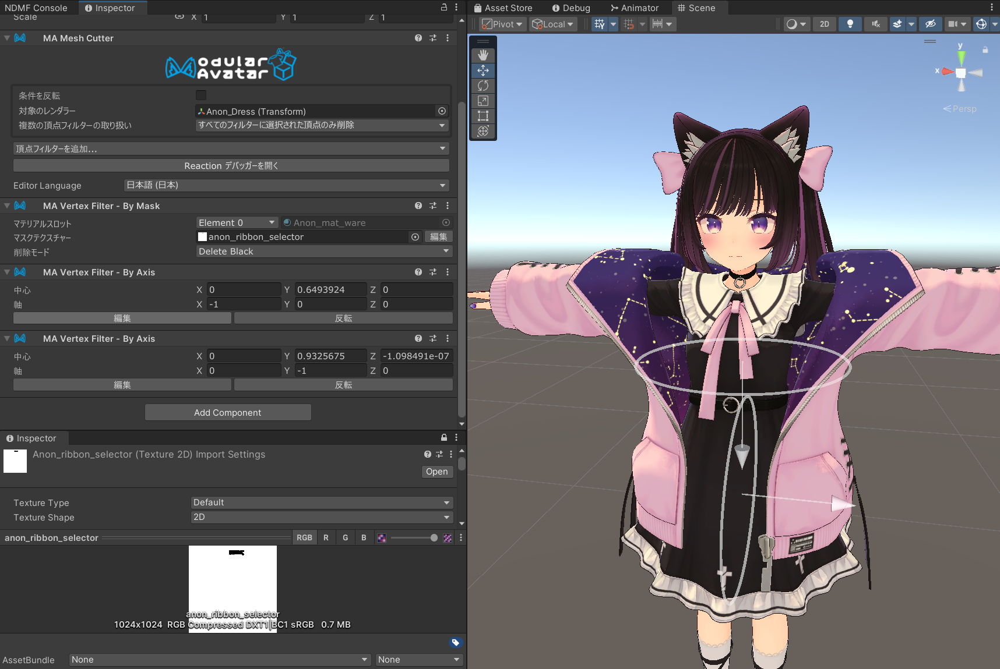

# Mesh Cutter

Mesh Cutterとは、メッシュの一部を頂点フィルターで指定して削除または非表示にできるコンポーネントです。
Mesh Cutterは[リアクティブコンポーネント](../)の一種です。リアクティブコンポーネントの一般的なルールと動作については、
そのページを参照してください。

## いつ使うべきですか？

Mesh Cutterは様々な用途がありますが、一例としては、

- 衣服の外層を貫通する素体のメッシュを非表示にする
- リボンの片側を短くするなど、見た目調整の目的でメッシュの一部を削除する
- ポリゴン数を削減するためにメッシュの不要な部分を削除する

## 非推奨の場合

メッシュが他のメッシュで完全に覆われているためにオフにする場合は、
代わりに[オブジェクトの切り替え](../object-toggle.md)を使用してください。
Mesh Cutterを仕様してもメッシュ全体を処理する必要があるため、こちらの方がパフォーマンス的に推奨されます。

## Mesh Cutterのセットアップ

Mesh Cutterをセットアップするには、Mesh Cutterコンポーネントと、最低一つの頂点フィルターコンポーネント(`Vertex Filter`)
を追加する必要があります。
まず、Mesh Cutterコンポーネントを追加し、変更したいオブジェクトを`Object`欄に設定します。
Mesh Cutterがアクティブになっている間、（リアクティブコンポーネントのルールに従って）このオブジェクトの頂点を非表示にします。
非アクティブ時に削除したい場合は、`Invert`ボックスにチェックを入れてください。

次に、同じオブジェクトに、1つ以上の頂点フィルターコンポーネントを追加します。
Mesh Cutterコンポーネントの「頂点フィルターを追加」ボタンをクリックするか、手動で頂点フィルターコンポーネントを追加
してください。

### 頂点フィルターのリスト

- [By Mask](./by-mask.md) - マスクテクスチャを使用してメッシュの一部を選択できます。
- [By Axis](./by-axis.md) - 平面の片側であるかどうかでメッシュの一部を選択できます。
- [By Bone](./by-bone.md) - 特定のボーンに対するボーンウェイトに基づいてメッシュの一部を選択できます。

## 複数の頂点フィルターの使用

複数の頂点フィルターを追加した場合、すべてのフィルターに一致する頂点のみが非表示になります。
これにより、単一のフィルターではできない複雑な選択が可能になります。例えば、メッシュが左右で同じUV座標を再利用している場合、
`By Mask`フィルターを使用して該当部分を選択し、By Axisフィルターを使用して片側のみに制限できます。

複数のフィルターを使用してリボンメッシュの片側を短くする例がこちらです。

あのんちゃんのリボンは左右で同じテクスチャ座標を使用しているため、単一の`By Mask`フィルターで左側だけを選択することはできません。
代わりに、`By Mask`フィルターでリボン全体を選択し、1つの`By Axis`フィルターで左側を選択し、もう1つの`By Axis`フィルターで
どれだけリボンを短くするかを選択しています。

## 効率や描写負荷に関する注意点

Mesh Cutterが常にアクティブな場合、Modular Avatarは選択されたポリゴンを完全に削除します。
これを使用して、パフォーマンスランクの制限を超えないようにポリゴン数を削減できます。

Mesh Cutterが時々非アクティブになる場合、Modular Avatarは選択されたポリゴンを非表示にします。
場合によっては、Constraint を生成する必要があり、パフォーマンスランクの増加に寄与する可能性がありますのでご注意ください。