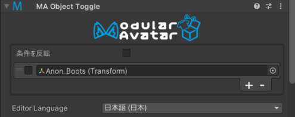

# Object Toggle

Object Toggle コンポーネントは、制御オブジェクトのアクティブ状態に基づいて、他のいくつかのGameObjectのアクティブ状態を変更するコンポーネントです。

## いつ使うべきか？

このコンポーネントは、他の衣服に完全に覆われたときに、隠されたメッシュを無効にしたい場合に便利です。例えば、他の衣服に完全に覆われたときに
下着メッシュを無効にしたい場合に使えます。

## Object Toggleの設定

制御オブジェクトに Object Toggle コンポーネントを追加し、+ をクリックして制御される対象オブジェクトを選択します。
チェックマークは、対象オブジェクトが有効か無効かを制御します。

### コンフリクト解決

複数の Object Toggle がアクティブで、同じ対象オブジェクトを制御しようとする場合、階層順に最後になる Object Toggle
の設定が採用されます。

対象オブジェクトを操作する Object Toggle がすべて非アクティブ状態の場合、オブジェクトの元の状態、または（他のアニメーションがそのオブジェクト
を操作している場合）アニメーション状態が採用されます。

### 応答タイミング

Object Toggle は、制御オブジェクトが更新された後の1フレーム後に影響を受けるオブジェクトを更新します。不幸な「事故」を避けるため、
Object Toggle が無効になると、無効になったオブジェクト（Object Toggle 自体か、その親など）が本来より１フレーム後に無効になります。
これにより、外側の衣装を無効化するとき、内側のメッシュが再度有効になるまで、外側のメッシュが表示され続けることが保証されます。

Object Toggle を使用して他の Object Toggle を制御する場合、この遅延は各 Object Toggle にのみ適用されます。つまり、A -> B ->
C という
構造で A がオフになった場合、タイミングは次のようになります：

* フレーム1：何も起こらない（Aの無効化が遅延）
* フレーム2：Aが無効化される（Bの無効化が遅延）
* フレーム3：BとCが同時に無効化されます。

### プレビューシステムの制限

Object Toggle がメッシュの可視性に与える影響は、エディタのシーンビューにすぐに反映されます。ただし、Object Toggle
が他の応答コンポーネント、
例えば他の Object Toggle または [Shape Changers](./shape-changer.md) に与える影響は、プレビュー表示には反映されません。
Object Toggle の完全な効果を確認するには、再生モードに入る必要があります。
