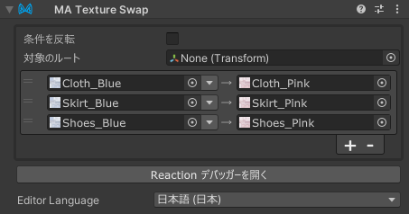

# Texture Swap

Texture Swap コンポーネントは、Texture Swap コンポーネントの GameObject が有効になっているときに、
アバター内のテクスチャを別のテクスチャに一括で置換します。

Texture Swap は [リアクティブコンポーネント](./index.md) の一種です。リアクティブコンポーネントの一般的なルールと動作については、
[リアクティブコンポーネント](./index.md) ページを参照してください。

## いつ使うべきか？

Texture Swap は、アバター内のテクスチャを一括で置換するために使用できます。Menu Item の動作、もしくは他のオブジェクトの表示/非表示に応じて、
アバター内のテクスチャを一括で置換することができます。

1 つのマテリアルに複数の Texture Swap コンポーネントは同時に適用されないことに注意してください。

## Texture Swap の設定

Texture Swap コンポーネントを、その状態を制御する GameObject にアタッチします。アタッチするオブジェクトは、アニメーションで有効/無効になる
オブジェクトであってもよいし、Menu Item（またはその子オブジェクト）であってもよいです。また、常に有効のオブジェクトにつけることで固定で
テクスチャを置換することもできます。

次に、新しいエントリを追加するために + ボタンをクリックします。
置換元のテクスチャを左のテクスチャ欄にドラッグし、置換先のテクスチャを右のテクスチャ欄にドラッグします。

対象を特定の階層下のみに限定にしたい場合は、「対象のルート」を指定してください。

デフォルトでは、Texture Swap は GameObject が有効になっているとき（および/または関連するメニューアイテムが選択されているとき）に
テクスチャを置換します。GameObject が無効になったときにテクスチャを置換したい場合は、「条件を反転」を選択してください。