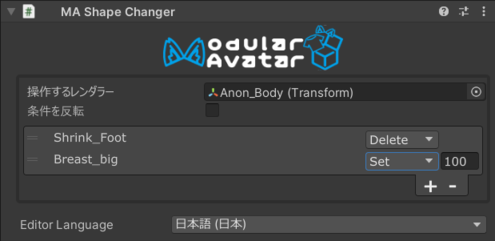

# Shape Changer

Shape Changerコンポーネントは、有効になっているときに、アバター内の別のレンダラーのシェープキー（Blend Shape）を変更します。

## いつ使うべきか？

このコンポーネントは、衣装メッシュに使用することを想定しており、衣装メッシュによって隠されたり干渉されたりする素体モデルの一部を自動的に削除または
縮小します。

## 非推奨の場合

このコンポーネントは、他のアニメーションによっても操作されるシェイプキーを変更するために使用すべきではありません。
変わりにShape Changerコンポーネントを含むオブジェクトのオン/オフの状態をアニメーション化してください。

## Shape Changerの設定

衣装ないのオブジェクトにShape Changerコンポーネントをアタッチします。通常、Skinned Mesh Rendererのあるオブジェクトにアタッチします。
調整したいレンダラー（つまり、アバターの素体メッシュ）を`Target Renderer`フィールドに配置します。

次に、`+`アイコンをクリックしてシェイプキーの選択ウィンドウを表示します。シェイプキーの名前をクリックするとShape Changerに追加されます。
Shape Changerの効果は、シーンビューでリアルタイムに表示されます。選択した部分は、衣装メッシュの下に隠れていることが多いため、シーンビューで
'overdraw'デバッグオーバーレイを使用して、衣装の下を見透かしてみると、何が起きているかが見やすくなります。

### シェイプ変更モード

各シェイプキーは、'Delete'または'Set'モードに設定できます。'Set'モードでは、Shape Changerがアクティブなときに指定された値に
シェイプキーが設定されます。　'Delete'モードでは、Shape Changerは指定のシェイプキーによって影響を受けるポリゴンを削除しようとします。
ただし、Shape Changerが常にアクティブでない場合（つまり、それをオンとオフに切り替えるアニメーションがある場合）、代わりにシェイプキーを
100%にアニメーションするようになります。

一般的に、Deleteは、シェイプキーが体の一部をなくすために使われる場合に使用されるべきです。アニメーションが存在しない場合には、より最適化された
アバターが生成されます。

### アニメーションとの相互作用

Shape Changerは、そのGameObjectとその親のアニメーションに応答します。これらのゲームオブジェクトを無効にすると、Shape Changerが無効化されます。
衣装を切り替えたり、衣装の一部を脱いだりしたときに、素体メッシュを自動的に復活させるのに便利です。

複数のShape Changerが同時に同じシェイプキーを操作しようとする場合、一般的にはHierarchyで見た時最も低い位置にあるShape Changerが優先されます。