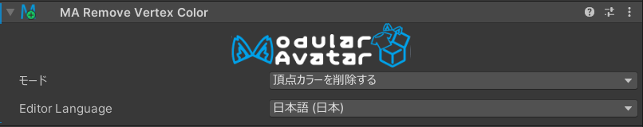
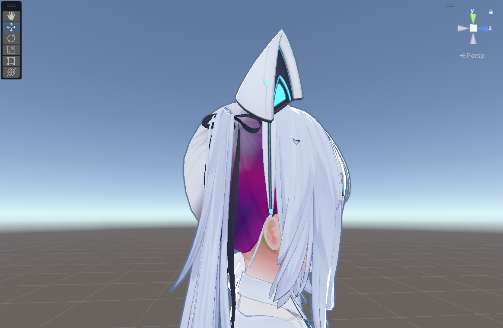
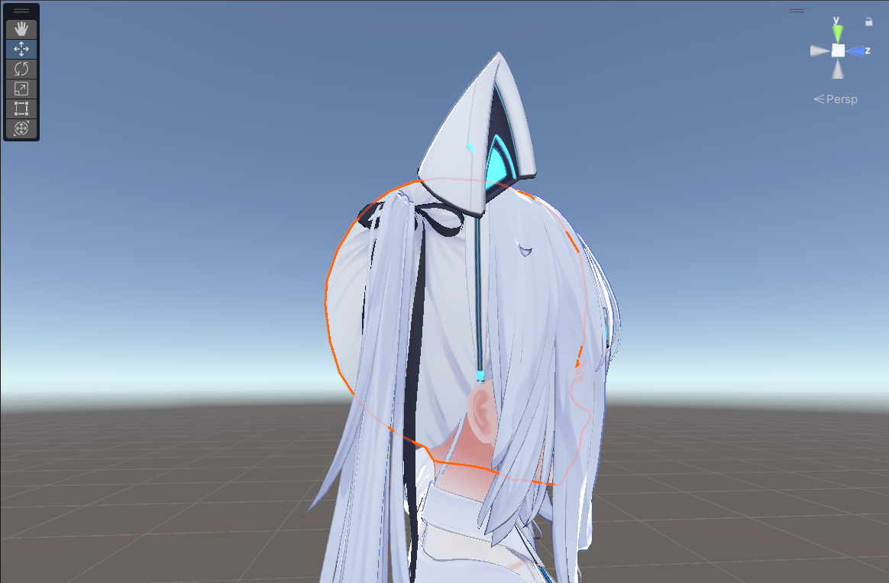

# Remove Vertex Color

Remove Vertex Color コンポーネントは、アタッチされたオブジェクトとその子オブジェクトから頂点カラーを削除します。

## いつ使うものか？

時々、アバターや衣装には意図されていない頂点カラーが付いていることがあります。VRChat Mobile系統など頂点カラーを使用するシェーダーに変更すると、
変色してしまうことがあります。このコンポーネントを使えば、非破壊的に問題の頂点カラーを削除できます。

    

        

        
        

        *Remove Vertex Color を使わないと、このアバターの髪の毛に不要な頂点カラーで変色してしまいます。*
    

    

        

        
        

        *Remove Vertex Color を追加した後、アバターの髪の色が正しくなります。*
    

## 詳細な使い方

Remove Vertex Color コンポーネントをアバターのオブジェクトに追加してください。通常、ルートオブジェクトに追加するだけで十分です。
このオブジェクト以下のすべてのオブジェクトの頂点カラーが削除されます。

特定のオブジェクトを除外したい場合は、除外したいオブジェクトに Remove Vertex Color コンポーネントを追加し、モードを「頂点カラーを削除しない」
に設定してください。このオブジェクト以下のオブジェクトの頂点カラーは削除されません。
