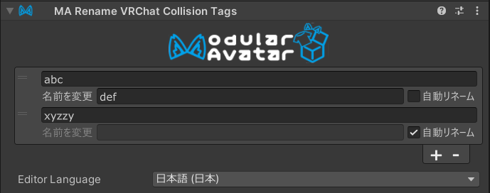

# Rename VRChat Collision Tags

`MA Rename Collision Tags`コンポーネントを使用すると、VRChat Contactsシステムで使用される接触判定用のタグを
名前変更して、他のコンポーネントやギミックとの名前の衝突を回避できます。

## いつ使用すべきですか？

`MA Rename Collision Tags`コンポーネントは、他のユーザーのアバターと干渉しないようにしたい接触判定がある場合や、
他のコンポーネントやギミックとの名前の衝突を回避したい場合に使用します。
また、同じタグ名を使用して複数のギミックをあえて相互作用させる設定にするためにも使用できます。

## 使い方は？

`MA Rename Collision Tags`コンポーネントをアバターの任意のGameObjectに配置し、名前を変更したいタグを追加します。
タグを「自動リネーム」に設定すると、Modular Avatarが自動的に衝突しない名前を選定します。
手動で名前を設定することもできます。同じGameObjectの下にあるContactsのタグは、それに応じて名前が変更されます。

`MA Rename Collision Tags`コンポーネントを、Contactsの`Root Transform`の親GameObjectに配置しても、
そのContactsのタグは変更されませんので注意してください。

`MA Rename Collision Tags`コンポーネントを別の`MA Rename Collision Tags`コンポーネントの下にネストすることもできます。
この場合、タグは最初に子コンポーネントの設定に従って名前が変更され、その後親コンポーネントの設定が適用されます。
これにより、名前変更ルールの階層を作成し、より複雑なギミックを単純なコンポーネントから構築することができます。