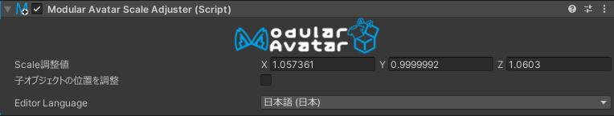

# Scale Adjuster

Scale Adjusterを付けることで、回転した子ボーンに影響を与えることなく、ボーンのX/Y/Zスケールを個別に調整することができます。

## いつ使うべきか？

このコンポーネントは、非対応衣装を導入するときに利用することを想定しています。これを利用すると、子ボーンを壊すことなく、
特定のボーンの寸法を調整できます。

## 非推奨の場合

ボーンの全体のスケールを変更する場合(X/Y/Zが連動して変わる場合)は、Unity標準のスケールツールを使いましょう。

## 設定方法

該当のボーンにScale Adjusterコンポーネントを追加します。これで、スケールツールを選択したときに、このボーンのみに影響が出ます。

「子オブジェクトの位置を調整」という設定を入れると、親のスケールが変わる時は子ボーンの相対位置も調整されます。逆にオフにすることで、
子ボーンを移動させずに親のスケールを調整できます。なお、子ボーンの位置のみが調整されます。子ボーンのスケールが変更されません。

複数のボーンのスケールを同時に調整することも対応しています。該当するボーンすべてにScale Adjusterを追加して、複数選択でスケール調整
するとすべて同時に編集できます。ただし、ボーンが回転された場合は完璧に連動が取れない場合があります。ご注意ください。

:::warning

Scale Adjusterはスケール（拡大縮小）ツールのみに対応しています。移動・回転・スケールをまとめたツールでは、従来通り子ボーンにも影響が出ます。

:::
