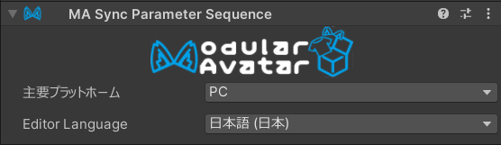

# Sync Parameter Sequence

VRChatでは、異なるプラットフォーム間で共有されるパラメータ（例：PCとAndroid）が、パラメータリストの先頭に、同じ順序で登録してある必要が
あります。このコンポーネントは、アバターがPCとAndroid間で正しく同期するために、表情パラメータの順序を調整し、必要に応じてパラメータを追加します。

## いつ使うべきか？

同じアバターの異なるバージョンをPCとAndroidにアップロードし、両方のバージョンが同期パラメータを使用する場合、このコンポーネントを使用すると
便利です。

## 使わない方がいい場合

このコンポーネントは、Parameter Compressorなど一部のVRCFuryコンポーネントと互換性問題がある可能性があります。

## 使い方

アバターのどこかのオブジェクトに Sync Parameter Sequence のコンポーネントを追加しましょう。
そのあと、主要プラットホームとなるプラットホームを選択してください。アバターの主要プラットホーム用バージョンには、
使用するすべてのパラメーターを登録する必要があります。
また、VRCSDKのプラットホームオーバーライドを使用していない場合、プラットホーム用のアバターバリエーションにも
同じ設定で追加してください。

主要プラットホームでまずビルドした上で、その後ほかのプラットホームをビルドしましょう。同じブループリントIDで
ビルドすると、Modular Avatar が自動的にパラメーターの内容を同期します。

:::warning

主要プラットホームのアバターには、ほかのプラットホームで使用するすべてのパラメーターを含む必要があります。
欠けている場合はビルドが失敗します。