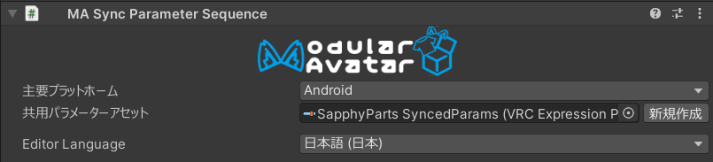

# Sync Parameter Sequence

VRChatでは、異なるプラットフォーム間で共有されるパラメータ（例：PCとAndroid）が、パラメータリストの先頭に、同じ順序で登録してある必要が
あります。このコンポーネントは、アバターがPCとAndroid間で正しく同期するために、表情パラメータの順序を調整し、必要に応じてパラメータを追加します。

## いつ使うべきか？

同じアバターの異なるバージョンをPCとAndroidにアップロードし、両方のバージョンが同期パラメータを使用する場合、このコンポーネントを使用すると
便利です。

## 使わない方がいい場合

このコンポーネントは、Parameter Compressorなど一部のVRCFuryコンポーネントと互換性問題がある可能性があります。

## 使い方 {#how-to-use}

アバターのどこかのオブジェクトに Sync Parameter Sequence のコンポーネントを追加しましょう。
そのあと、主要プラットフォームとなるプラットフォームを選択してください。アバターの主要プラットフォーム用バージョンには、
使用するすべてのパラメーターを登録する必要があります。

主要プラットフォームでまずビルドしてアップロードした上で、その後ほかのプラットフォーム（AndroidやiOSなど）でビルドして
アップロードしましょう。主要プラットフォームを先にアップロードすれば、Sync Parameter Sequence が自動的にすべてのプラット
フォーム間でパラメーターの順序を統一します。

:::tip VRChatのプラットフォームごとのオーバーライド機能を使用する場合

VRChatのプラットフォームごとのオーバーライド機能を使用している場合は、元のアバターにのみ Sync Parameter Sequence コンポー
ネントを追加する必要があります。オーバーライドアバター側には追加する必要がありません。Sync Parameter Sequence は、オーバー
ライドアバターに欠けているパラメーターを、主要プラットフォームのメインアバターから自動的に伝播します。

:::

:::warning パラメーターの要件

主要プラットフォームのアバターには、ほかのプラットフォームで使用するすべてのパラメーターを含む必要があります。
欠けている場合はビルドが失敗します。

:::