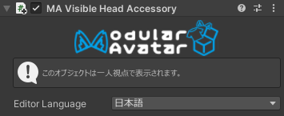

# Visible Head Accessory

このコンポーネントを付けることで、Head以下のGameObjectが一人視点で表示されるようにできます。

## いつ使うもの？

自分の髪の毛や、その他頭に追従するアクセサリーをミラー等を使わなくても見れるようにしたいとき。

## 非推奨の場合

このコンポーネントはPhysBonesで操作されたオブジェクトの子では使えません（ルートには使えます）

Head以下のすべての子で使うと、前髪が邪魔になることがあるので要注意。

また、このコンポーネントは処理が若干重いので、ビルド処理が数秒伸びることがあります。

## セットアップ方法

Headボーンの子にVisible Head Accessoryコンポーネントを付けるだけです。設定はありません。

このコンポーネントは自動的にHeadボーンを複製し、Parent Constraintで本物のHeadボーンに追従させます。
複数のVisible Head Accessoryコンポーネントを使っても、Constraintは一つだけです。なので、複数のボーンを指定しても、その分重くなることはありません。
