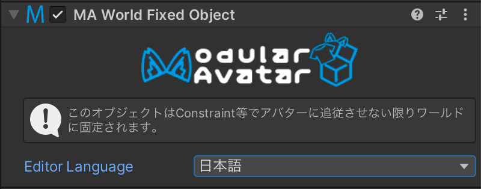

# World Fixed Object

このコンポーネントを付けることで、GameObjectをワールドに固定できます。

## いつ使うもの？

GameObjectをワールド固定したいとき。

## セットアップ方法

ワールド固定したいGameObjectにWorld Fixed Objectコンポーネントをつけるだけです。設定はありません。

このコンポーネントは自動的にワールド原点に固定されたGameObjectをアバター直下に作り、その子にWorld Fixed ObjectのついたGameObjectを移動させます。
World Fixed ObjectのついたGameObjectはParent Constraint等を使用してワールド内の位置を調整できます。

複数のWorld Fixed Objectコンポーネントを使っても、Constraintは一つだけです。なので、複数のGameObjectを指定しても、その分重くなることはありません。

技術的な制約により、Quest単体では動作できず、Quest向けのビルドでは使用できません。